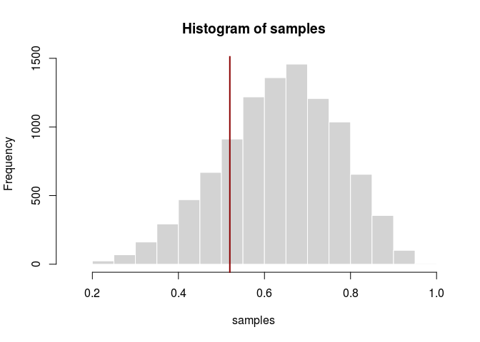
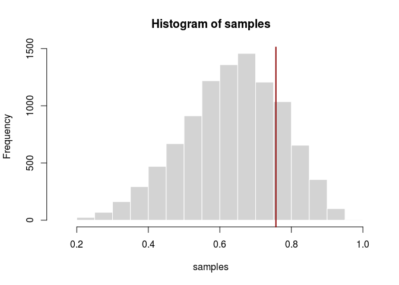
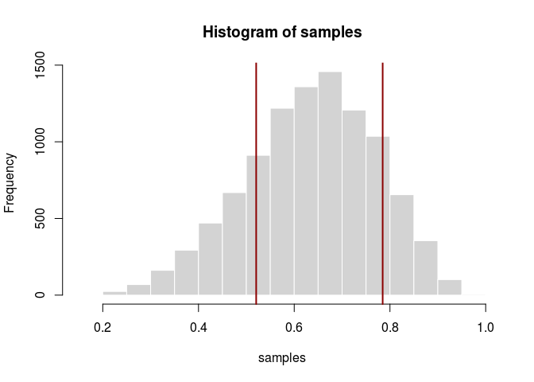
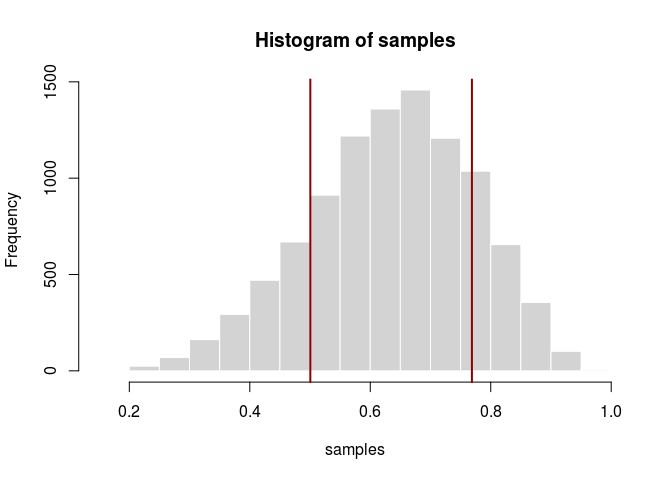
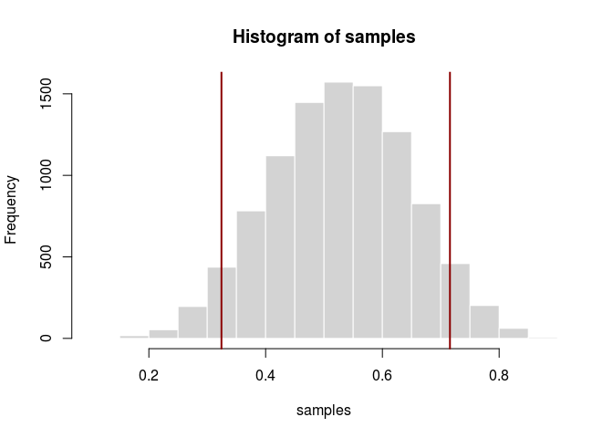

# Statistical Rethinking Chapter 3 problems

__Name__: Em 

## 3E1

```
## Loading required package: rstan
```

```
## Loading required package: ggplot2
```

```
## rstan (Version 2.9.0-3, packaged: 2016-02-11 15:54:41 UTC, GitRev: 05c3d0058b6a)
```

```
## For execution on a local, multicore CPU with excess RAM we recommend calling
## rstan_options(auto_write = TRUE)
## options(mc.cores = parallel::detectCores())
```

```
## Loading required package: parallel
```

```
## rethinking (Version 1.58)
```


```r
sum(samples<0.2)/length(samples) #the proportion of samples < 0.2 
```

```
## [1] 5e-04
```
## 3E2


```r
sum(samples>0.8)/length(samples) #the proprtion of samples >0.8
```

```
## [1] 0.1117
```

## 3E3

```r
sum(samples<0.8&samples>0.2)/length(samples) #the proprtion of samples <0.8 and > 0.2
```

```
## [1] 0.8878
```

## 3E4

```r
quantile(samples, 0.2) #20% of the samples lie below
```

```
##       20% 
## 0.5195195
```

```r
hist(samples, border = "white", col="lightgray")
abline(v=quantile(samples,0.2), col = "darkred", lwd=2)
```




## 3E5

```r
quantile(samples, 0.8) #80% of the samples lie above
```

```
##       80% 
## 0.7567568
```

```r
hist(samples, border = "white", col="lightgray")
abline(v=quantile(samples,0.8), col = "darkred", lwd=2)
```




## 3E6

```r
HPDI(samples, prob=0.66)
```

```
##     |0.66     0.66| 
## 0.5205205 0.7847848
```

```r
hist(samples, border = "white", col="lightgray")
abline(v=HPDI(samples, prob=0.66)[1], col = "darkred", lwd=2)
abline(v=HPDI(samples, prob=0.66)[2], col = "darkred", lwd=2)
```



## 3E7

```r
PI(samples, prob=0.66)
```

```
##       17%       83% 
## 0.5005005 0.7687688
```

```r
hist(samples, border = "white", col="lightgray")
abline(v=PI(samples, prob=0.66)[1], col = "darkred", lwd=2)
abline(v=PI(samples, prob=0.66)[2], col = "darkred", lwd=2)
```



## 3M1

```r
p_grid <- seq( from=0 , to=1 , length.out=1000 )
prior <- rep( 1 , 1000 )
likelihood <- dbinom( 8 , size=15 , prob=p_grid )
posterior <- likelihood * prior
posterior <- posterior / sum(posterior)
```


## 3M2

```r
set.seed(100)
samples <- sample( p_grid , prob=posterior , size=1e4 , replace=TRUE )
hist(samples, col="lightgray", border="white")
HPDI(samples, prob=0.9)
```

```
##      |0.9      0.9| 
## 0.3243243 0.7157157
```

```r
abline(v=HPDI(samples, prob=0.9)[1], col = "darkred", lwd=2)
abline(v=HPDI(samples, prob=0.9)[2], col = "darkred", lwd=2)
```




_STOP AFTER 3M2 FOR 02/25 ASSIGNMENT_

## 3M3

## 3M4

## 3M5

## 3H1

## 3H2

## 3H3

## 3H4

## 3H5
