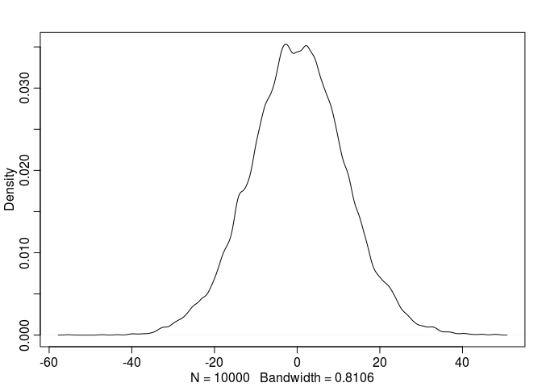

# Statistical Rethinking Chapter 4 problems

__Name:__Emily Josephs


# For 03/17/16

## 4E1

y<sub>i</sub> is the likelihood

## 4E2

There are two parameters in the posterior

## 4E3

Posterior = (Likelihood x Prior)/Average Likelihood
$$Pr(\mu,\sigma|h) = \frac{\prod_{i}Normal(h_{i}|\mu,\sigma)Normal(\mu|0,10)Uniform(\sigma|0,10)}{average likelihood}$$

## 4M1

```r
dummy_mu <- rnorm(1e4, mean=0, sd=10)
dummy_sigma <- runif(1e4, min=0, max=10)
dummy_heights = rnorm(1e4, mean=dummy_mu, sd=dummy_sigma)

library(rethinking)
dens(dummy_heights)
```

 

## 4M2

```r
mylist <-alist(
height ~ dnorm(mu,sigma),
mu ~ dnorm(0,10),
sigma ~ dunif (0,10)
)
```

# For 03/24/16

## 4E4

line 2, $$\mu_{i} = \alpha + \beta x_{i} $$

## 4E5
Three parameters: $$\alpha, \beta, \sigma$$

## 4M3
$$y_{i} \sim Normal(\mu, \sigma)$$  
$$ \mu = a+ bx $$
$$ a \sim Normal(0,50) $$
$$ b \sim Uniform(0,10) $$
$$ \sigma \sim Uniform(0,50) $$


## 4M4
$$ let\ x_{i} = year $$
$$y_{i} \sim Normal(\mu, \sigma)$$
$$ \mu_{i} = \alpha + \beta x_{i} $$
$$ \alpha \sim Normal(150, 10) $$
$$ \beta \sim Normal(3, 1) $$
$$ \sigma \sim Uniform(0,50) $$


## 4M5
Yes, I would now set
$$ \alpha = 120 $$
but leave the others

## 4M6
I would leave my priors the same


# For 03/31/16

## 4H1

## 4H2

## 4H3
