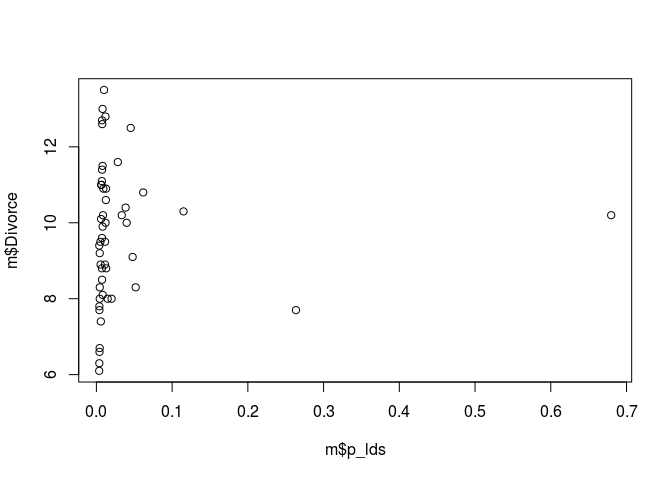

# Statistical Rethinking Chapter 4 problems

__Name:__Em


# For 04/11/2016

## 5E1
2 and 4 are multiple linear regressions I think (I'm not sure if an intercept is required)

## 5E2
Write down a multiple regression to evaluate the claim: Animal diversity is linearly related to latitude, but only after controlling for plant diversity. You just need to write down the model definition.

D<sub>a</sub> = animal diversity
D<sub>p</sub> = plant diversity
l = latitude

D<sub>a</sub> ~ Normal(μ, σ)
μ = α + β<sub>p</sub>D<sub>p</sub> + β<sub>l</sub>l
α ~ Normal(10,10) #not sure what diversity index we're using?
β<sub>p</sub> ~ Normal(0,1)
β<sub>l</sub> ~ Normal(0,1)
σ ~ Uniform(0,10)

## 5M1
The number of yoga studios in a neighborhood is correlated with the average income in the neighborhood. Average income is also correlated with SAT scores in local high schools. The spurious correlation is that yoga improves SAT scores.

## 5M3
A high divorce rate increases the number of marriages per person that can occur.

R<sub>i</sub> = marriage rate
A<sub>i</sub> = age at marriage
D<sub>i</sub> = divorce rate

D<sub>r</sub> ~ Normal(μ, σ)
μ = α + β<sub>a</sub>A<sub>i</sub> + β<sub>d</sub>D<sub>i</sub>
α ~ Normal(10,10)
β<sub>a</sub> ~ Normal(0,1)
β<sub>d</sub> ~ Normal(0,1)
σ ~ Uniform(0,10)

I'm not sure if this model would actually tell you anything?

## 5M4


```r
lds <- read.csv('~/Documents/Rclub-rethinking_Emily.Josephs/Assignment_Chapter_05/lds-stats.csv',header=T)
lds$p_lds = lds$Membership/lds$Population
d$MedianAgeMarriage.s <- (d$MedianAgeMarriage-mean(d$MedianAgeMarriage))/
sd(d$MedianAgeMarriage)
d$Marriage.s <- (d$Marriage - mean(d$Marriage))/sd(d$Marriage)

m <- merge(lds, d, by = "Location")

plot(m$p_lds, m$Divorce) #this is not promising
```

 

```r
#not standardized
ml <- map(
alist(
Divorce ~ dnorm( mu , sigma ) ,
mu <- a + bR*Marriage.s + bA*MedianAgeMarriage.s +bL*p_lds,
a ~ dnorm( 10 , 10 ) ,
bR ~ dnorm( 0 , 1 ) ,
bA ~ dnorm( 0 , 1 ) ,
bL ~ dnorm( 0 , 1 ) ,
sigma ~ dunif( 0 , 10 )
) ,
data = m )
precis( ml )
```

```
##        Mean StdDev  5.5% 94.5%
## a      9.72   0.20  9.40 10.04
## bR    -0.10   0.28 -0.54  0.34
## bA    -1.16   0.28 -1.60 -0.72
## bL    -0.92   0.93 -2.42  0.57
## sigma  1.41   0.14  1.18  1.64
```

```r
#standardized
m$s_lds <- (m$p_lds-mean(m$p_lds))/sd(m$p_lds)
mls <- map(
alist(
Divorce ~ dnorm( mu , sigma ) ,
mu <- a + bR*Marriage.s + bA*MedianAgeMarriage.s +bL*s_lds,
a ~ dnorm( 10 , 10 ) ,
bR ~ dnorm( 0 , 1 ) ,
bA ~ dnorm( 0 , 1 ) ,
bL ~ dnorm( 0 , 1 ) ,
sigma ~ dunif( 0 , 10 )
) ,
data = m )
precis( mls )
```

```
##        Mean StdDev  5.5% 94.5%
## a      9.69   0.19  9.38  9.99
## bR     0.06   0.27 -0.38  0.49
## bA    -1.27   0.27 -1.70 -0.85
## bL    -0.58   0.22 -0.93 -0.23
## sigma  1.34   0.13  1.13  1.56
```

So there's only a negative relationship between LDS and divorce rate if we standardize LDS percentage.

