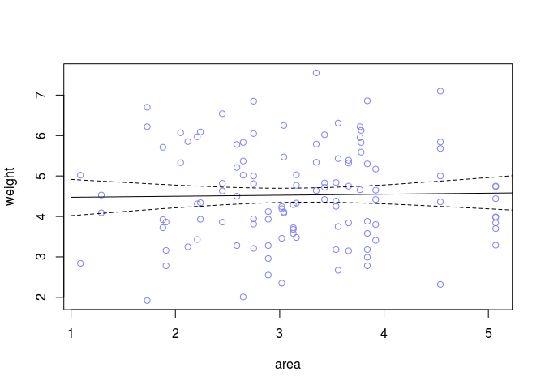
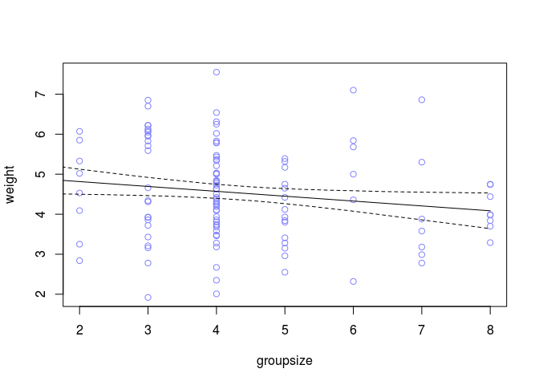
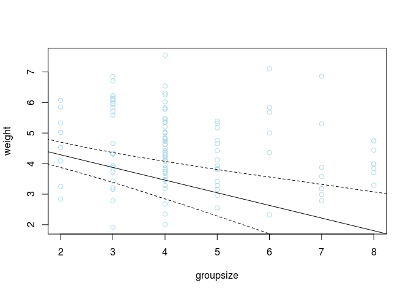
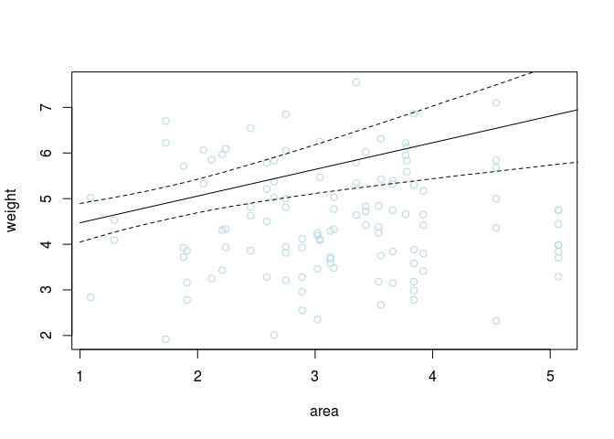
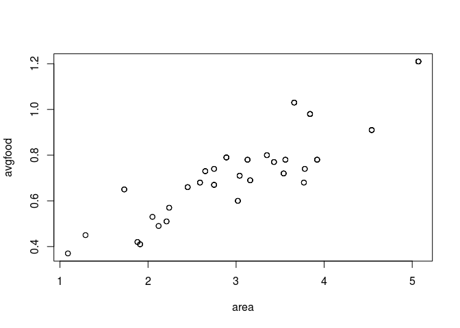

# Chapter-05-part2-assignment
# Statistical Rethinking Chapter 4 problems

__Name:__Emily Josephs


# For 04/18/2016

## 5M2
Invent your own example of a masked relationship. An outcome variable should be correlated
with both predictor variables, but in opposite directions. And the two predictor variables should be
correlated with one another.

Imagine a farmer with multiple plots of tomatoes. Some of the plots are in soil that drains faster and so the tomatoes do less well. The farmer occasionally waters plants in the drier plots, but not enough to make them as productive as the wetter plots. This might lead to a negative correlation between supplemental watering and yield because the effects of soil type are masked.

## 5H1
Fit two bivariate Gaussian regressions, using map : (1) body weight as a linear function of ter-
ritory size ( area ), and (2) body weight as a linear function of groupsize . Plot the results of these
regressions, displaying the MAP regression line and the 95% interval of the mean. Is either variable
important for predicting fox body weight?


```r
data(foxes)
#str(foxes)

m5H1.1 <- map(
alist(
weight ~ dnorm( mu , sigma ) ,
mu <- a + ba*area ,
a ~ dnorm( 0 , 10 ) ,
ba ~ dnorm( 0 , 1 ) ,
sigma ~ dunif( 0 , 10 )
) ,
data=foxes )
precis(m5H1.1)
```

```
##       Mean StdDev  5.5% 94.5%
## a     4.45   0.39  3.83  5.07
## ba    0.03   0.12 -0.16  0.21
## sigma 1.18   0.08  1.06  1.30
```

```r
np.seq = seq(1,6, by = 0.05)
pred.data <- data.frame( area=np.seq )
mu <- link( m5H1.1 , data=pred.data , n=1e4, refresh=0 )
mu.mean <- apply( mu , 2 , mean )
mu.PI <- apply( mu , 2 , PI )
plot( weight ~ area , data=foxes , col=rangi2 )
lines( np.seq , mu.mean )
lines( np.seq , mu.PI[1,] , lty=2 )
lines( np.seq , mu.PI[2,] , lty=2 )
```



```r
m5H1.2 <- map(
alist(
weight ~ dnorm( mu , sigma ) ,
mu <- a + bg*groupsize ,
a ~ dnorm( 0 , 10 ) ,
bg ~ dnorm( 0 , 1 ) ,
sigma ~ dunif( 0 , 10 )
) ,
data=foxes )
precis(m5H1.2)
```

```
##        Mean StdDev  5.5% 94.5%
## a      5.06   0.32  4.54  5.58
## bg    -0.12   0.07 -0.23 -0.01
## sigma  1.16   0.08  1.04  1.29
```

```r
np.seq = seq(1,8, by = 0.05)
pred.data <- data.frame( groupsize=np.seq )
mu <- link( m5H1.2 , data=pred.data , n=1e4, refresh=0 )
mu.mean <- apply( mu , 2 , mean )
mu.PI <- apply( mu , 2 , PI )
plot( weight ~ groupsize , data=foxes , col=rangi2 )
lines( np.seq , mu.mean )
lines( np.seq , mu.PI[1,] , lty=2 )
lines( np.seq , mu.PI[2,] , lty=2 )
```




## 5H2
Now fit a multiple linear regression with weight as the outcome and both area and groupsize
as predictor variables. Plot the predictions of the model for each predictor, holding the other predictor
constant at its mean. What does this model say about the importance of each variable? Why do you
get different results than you got in the exercise just above?


```r
m5H2 <- map(
alist(
weight ~ dnorm( mu , sigma ) ,
mu <- a + ba*area + bg*groupsize ,
a ~ dnorm( 0 , 10 ) ,
bg ~ dnorm( 0 , 1 ) ,
ba ~ dnorm( 0 , 1 ) ,
sigma ~ dunif( 0 , 10 )
) ,
data=foxes )
precis(m5H2)
```

```
##        Mean StdDev  5.5% 94.5%
## a      4.47   0.37  3.88  5.06
## bg    -0.41   0.12 -0.60 -0.23
## ba     0.59   0.20  0.28  0.90
## sigma  1.12   0.07  1.00  1.24
```

```r
mean.area <- mean( log(foxes$area) )
np.seq = seq(1,9, by = 0.05)
pred.data <- data.frame(
groupsize=np.seq,
area=mean.area
)
mu <- link( m5H2 , data=pred.data , n=1e4, refresh=0 )
mu.mean <- apply( mu , 2 , mean )
mu.PI <- apply( mu , 2 , PI )
plot( weight ~ groupsize , data=foxes, col="lightblue" )
lines( np.seq , mu.mean )
lines( np.seq , mu.PI[1,] , lty=2 )
lines( np.seq , mu.PI[2,] , lty=2 )
```



```r
mean.groupsize <- mean( log(foxes$groupsize) )
np.seq = seq(1,9, by = 0.05)
pred.data <- data.frame(
area=np.seq,
groupsize=mean.groupsize
)
mu <- link( m5H2 , data=pred.data , n=1e4, refresh=0 )
mu.mean <- apply( mu , 2 , mean )
mu.PI <- apply( mu , 2 , PI )
plot( weight ~ area , data=foxes, col="lightblue" )
lines( np.seq , mu.mean )
lines( np.seq , mu.PI[1,] , lty=2 )
lines( np.seq , mu.PI[2,] , lty=2 )
```




## 5H3
Finally, consider the avgfood variable. Fit two more multiple regressions: (1) body weight
as an additive function of avgfood and groupsize , and (2) body weight as an additive function of
all three variables, avgfood and groupsize and area . Compare the results of these models to the
previous models you’ve fit, in the first two exercises. (a) Is avgfood or area a better predictor of body
weight? If you had to choose one or the other to include in a model, which would it be? Support your
assessment with any tables or plots you choose. (b) When both avgfood or area are in the same
model, their effects are reduced (closer to zero) and their standard errors are larger than when they
are included in separate models. Can you explain this result?


```r
m5H3.1 <- map(
alist(
weight ~ dnorm( mu , sigma ) ,
mu <- a + bf*avgfood + bg*groupsize ,
a ~ dnorm( 0 , 10 ) ,
bg ~ dnorm( 0 , 1 ) ,
bf ~ dnorm( 0 , 1 ) ,
sigma ~ dunif( 0 , 10 )
) ,
data=foxes )
precis(m5H3.1)
```

```
##        Mean StdDev  5.5% 94.5%
## a      4.69   0.37  4.09  5.28
## bg    -0.30   0.11 -0.48 -0.11
## bf     1.51   0.78  0.26  2.76
## sigma  1.13   0.08  1.01  1.25
```

```r
m5H3.2 <- map(
alist(
weight ~ dnorm( mu , sigma ) ,
mu <- a + ba*area + bf*avgfood + bg*groupsize ,
a ~ dnorm( 0 , 10 ) ,
bg ~ dnorm( 0 , 1 ) ,
ba ~ dnorm( 0 , 1 ) ,
bf ~ dnorm( 0 , 1 ) ,
sigma ~ dunif( 0 , 10 )
) ,
data=foxes )
precis(m5H3.2)
```

```
##        Mean StdDev  5.5% 94.5%
## a      4.34   0.39  3.72  4.96
## bg    -0.47   0.13 -0.68 -0.26
## ba     0.51   0.21  0.18  0.85
## bf     0.81   0.82 -0.50  2.13
## sigma  1.11   0.07  0.99  1.23
```

a) I would pick area, because the direction of its effect on weight is more consistent across models and there is a smaller standard deviation around our estimates of the regression coefficient.
b) I think this happens because average food and area are causally related (larger territory areas have more food). This is diluting the effect that each variable has on weight.


```r
plot(avgfood ~ area, data=foxes)
```


 
