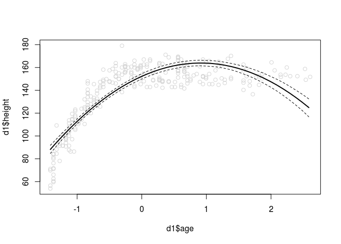

# Chapter-06-assignment
# Statistical Rethinking Chapter 6 problems

__Name:__Emily Josephs


## 6E1
Information entropy is kind of like the amount of variation in outcomes for a type of event. The motivating criteria are 
1. Continuity -- changing the probability a small amount won't change the entropy that much and vice versa. This makes sense because being close to the correct probability is more accurate than being further away.
2. Entropy should grow as the number of events grow because it is harder to choose among a larger number of outcomes.
3. Additivity -- the order of predictions shouldn't change our measure of entropy.

## 6E2
Entropy = -sum(p x log(p)) 

```r
probs = c(0.7, 0.3)
fentropy = function(p){-p*log(p)}
entropy = sum(fentropy(probs))
entropy
```

```
## [1] 0.6108643
```

```r
x = seq(0,1,by = 0.01)
plot(x, -fentropy(x)-fentropy(1-x), ylab = "entropy", xlab = "freq of heads")
```

<!-- -->

## 6E3


```r
probs = c(0.2, 0.25, 0.25, 0.3)
entropy = sum(fentropy(probs))
entropy
```

```
## [1] 1.376227
```

## 6E4


```r
probs = c(1/3,1/3,1/3)
entropy = sum(fentropy(probs))
entropy
```

```
## [1] 1.098612
```


## 6M1 
* AIC = training deviance + the number of free parameters. This only is reliable if 1) there are flat priors   (or it doesn't  matter because the likelihood is strong enough that the priors are unimportant) 2) the postior distribution is multivariate normal, and 3) the sample size is much larger than the number of parameters being estimated.

* DIC = Dbar - pD, where D is the average posterior distribution of the deviance and pD is the difference between the average distribution of the deviance and the deviance at the posterior's mean. pD, or the penalty term, is the effective number of parameters. If priors are flat, this is the AIC.

* WAIC = -2(lppd - pWAIC) where lppd is the sum of logs of the average likelihood of each observation in the training sample and pWAIC is the sum of the variances in log-likehood for each observation in the training sample. This is really different than the DIC and AIC because it works with the data point by point.


## 6M5 
Informative priors reduce overfitting because they keep the model from getting "too excited" about the data and just mimicking the data when it constructs the posterior distribution. Providing an informative prior keeps the model from learning too much from the training data set.


## 6M6
Overly informative priors result in underfitting because not enough information from the training dataset is making it into the model.


##  6J1: explore how the code in Code Block 6.16 works.  Explain what is happening in each line.

```r
data(cars)
m <- map(
alist(
dist ~ dnorm(mu,sigma),
mu <- a + b*speed,
a ~ dnorm(0,100),
b ~ dnorm(0,10),
sigma ~ dunif(0,30)
) , data=cars )
post <- extract.samples(m,n=1000)
#the code above fits a model for distance as a function of speed

n_samples <- 1000 #setting the number of samples 
ll <- sapply( 1:n_samples ,  #doing something 1000 times
function(s) { #that something is the function s
mu <- post$a[s] + post$b[s]*cars$speed # setting mu equal to the speed predicted by the intercept (a) and coeff time speed
dnorm( cars$dist , mu , post$sigma[s] , log=TRUE )  #getting the log-likelihood of mu, so that the function s is calculating the log likihoods for each sample from the posterior.
} )
```
##6M3


##6M4


## 6H1


```r
data(Howell1)
d <- Howell1
d$unnormage <- d$age
d$age <- (d$age - mean(d$age))/sd(d$age)
set.seed(1000)
i <- sample(1:nrow(d), size=nrow(d)/2)
d1 <- d[i,] #for model fitting
d2 <- d[-i,] #for evaluating model

m1 <- map(
alist(
height ~ dnorm(mu,sigma),
mu <- a + b*age,
a ~ dnorm(mean(height),25),
b ~ dnorm(0,10),
sigma ~ dunif(0,30)
) , data=d1 )

m2 <- map(
alist(
height ~ dnorm(mu,sigma),
mu <- a + b1*age + b2*age*age,
a ~ dnorm(mean(height),25),
b1 ~ dnorm(0,10),
b2 ~ dnorm(0,10),
sigma ~ dunif(0,30)
) , data=d1 )

m3 <- map(
alist(
height ~ dnorm(mu,sigma),
mu <- a + b1*age + b2*age*age + b3*age*age*age,
a ~ dnorm(mean(height),25),
b1 ~ dnorm(0,10),
b2 ~ dnorm(0,10),
b3 ~ dnorm(0,10),
sigma ~ dunif(0,30)
) , data=d1 )

m4 <- map(
alist(
height ~ dnorm(mu,sigma),
mu <- a + b1*age + b2*age*age + b3*age*age*age + b4*age*age*age*age,
a ~ dnorm(mean(height),25),
b1 ~ dnorm(0,10),
b2 ~ dnorm(0,10),
b3 ~ dnorm(0,10),
b4 ~ dnorm(0,10),
sigma ~ dunif(0,30)
) , data=d1 )

m5 <- map(
alist(
height ~ dnorm(mu,sigma),
mu <- a + b1*age + b2*age*age + b3*age*age*age + b4*age*age*age*age + b5*age*age*age*age*age,
a ~ dnorm(mean(height),25),
b1 ~ dnorm(0,10),
b2 ~ dnorm(0,10),
b3 ~ dnorm(0,10),
b4 ~ dnorm(0,10),
b5 ~ dnorm(0,10),
sigma ~ dunif(0,30)
) , data=d1 )

m6 <- map(
alist(
height ~ dnorm(mu,sigma),
mu <- a + b1*age + b2*age*age + b3*age*age*age + b4*age*age*age*age + b5*age*age*age*age*age + b6*age^6,
a ~ dnorm(mean(height),25),
b1 ~ dnorm(0,10),
b2 ~ dnorm(0,10),
b3 ~ dnorm(0,10),
b4 ~ dnorm(0,10),
b5 ~ dnorm(0,10),
b6 ~ dnorm(0,10),
sigma ~ dunif(0,30)
) , data=d1 )

plot(d1$height, d1$age)
```

<!-- -->

```r
#compare models with WAIC
mods <- c(m1,m2,m3,m4,m5,m6)
waics = sapply(mods, WAIC)
```

```
## Constructing posterior predictions
```

```
## [ 100 / 1000 ]
[ 200 / 1000 ]
[ 300 / 1000 ]
[ 400 / 1000 ]
[ 500 / 1000 ]
[ 600 / 1000 ]
[ 700 / 1000 ]
[ 800 / 1000 ]
[ 900 / 1000 ]
[ 1000 / 1000 ]
```

```
## Constructing posterior predictions
```

```
## [ 100 / 1000 ]
[ 200 / 1000 ]
[ 300 / 1000 ]
[ 400 / 1000 ]
[ 500 / 1000 ]
[ 600 / 1000 ]
[ 700 / 1000 ]
[ 800 / 1000 ]
[ 900 / 1000 ]
[ 1000 / 1000 ]
```

```
## Constructing posterior predictions
```

```
## [ 100 / 1000 ]
[ 200 / 1000 ]
[ 300 / 1000 ]
[ 400 / 1000 ]
[ 500 / 1000 ]
[ 600 / 1000 ]
[ 700 / 1000 ]
[ 800 / 1000 ]
[ 900 / 1000 ]
[ 1000 / 1000 ]
```

```
## Constructing posterior predictions
```

```
## [ 100 / 1000 ]
[ 200 / 1000 ]
[ 300 / 1000 ]
[ 400 / 1000 ]
[ 500 / 1000 ]
[ 600 / 1000 ]
[ 700 / 1000 ]
[ 800 / 1000 ]
[ 900 / 1000 ]
[ 1000 / 1000 ]
```

```
## Constructing posterior predictions
```

```
## [ 100 / 1000 ]
[ 200 / 1000 ]
[ 300 / 1000 ]
[ 400 / 1000 ]
[ 500 / 1000 ]
[ 600 / 1000 ]
[ 700 / 1000 ]
[ 800 / 1000 ]
[ 900 / 1000 ]
[ 1000 / 1000 ]
```

```
## Constructing posterior predictions
```

```
## [ 100 / 1000 ]
[ 200 / 1000 ]
[ 300 / 1000 ]
[ 400 / 1000 ]
[ 500 / 1000 ]
[ 600 / 1000 ]
[ 700 / 1000 ]
[ 800 / 1000 ]
[ 900 / 1000 ]
[ 1000 / 1000 ]
```

```r
plot(seq(1,6), waics, xlab = "number of terms in polymomial", ylab = "WAIC")
```

<!-- -->

```r
compare(m1,m2,m3,m4,m5,m6)
```

```
##      WAIC pWAIC dWAIC weight    SE   dSE
## m4 1926.2   5.7   0.0   0.54 25.44    NA
## m5 1927.7   6.4   1.5   0.26 25.64  0.43
## m6 1928.1   7.2   1.9   0.21 25.17  1.84
## m3 1952.8   5.7  26.6   0.00 24.34 11.09
## m2 2149.9   5.2 223.7   0.00 22.85 26.79
## m1 2395.5   3.5 469.3   0.00 23.19 31.10
```

## 6H2


```r
range(d1$age)
```

```
## [1] -1.41440  2.60548
```

```r
agesamp = data.frame(age=seq(range(d1$age)[1],range(d1$age)[2],by = 0.1))
x=m1
plotmods = function(x){
predic <- link(x, data = agesamp) #code from 6.29
mu <- apply(predic, 2, mean)
mu.PI <- apply(predic, 2, PI, prob=0.97)
plot(d1$age, d1$height, col = "lightgray")
lines(agesamp$age, mu, lwd=2)
lines(agesamp$age, mu.PI[1,], lty=2)
lines(agesamp$age, mu.PI[2,], lty=2)
}

sapply(mods,plotmods)
```

```
## [ 100 / 1000 ]
[ 200 / 1000 ]
[ 300 / 1000 ]
[ 400 / 1000 ]
[ 500 / 1000 ]
[ 600 / 1000 ]
[ 700 / 1000 ]
[ 800 / 1000 ]
[ 900 / 1000 ]
[ 1000 / 1000 ]
```

<!-- -->

```
## [ 100 / 1000 ]
[ 200 / 1000 ]
[ 300 / 1000 ]
[ 400 / 1000 ]
[ 500 / 1000 ]
[ 600 / 1000 ]
[ 700 / 1000 ]
[ 800 / 1000 ]
[ 900 / 1000 ]
[ 1000 / 1000 ]
```

<!-- -->

```
## [ 100 / 1000 ]
[ 200 / 1000 ]
[ 300 / 1000 ]
[ 400 / 1000 ]
[ 500 / 1000 ]
[ 600 / 1000 ]
[ 700 / 1000 ]
[ 800 / 1000 ]
[ 900 / 1000 ]
[ 1000 / 1000 ]
```

<!-- -->

```
## [ 100 / 1000 ]
[ 200 / 1000 ]
[ 300 / 1000 ]
[ 400 / 1000 ]
[ 500 / 1000 ]
[ 600 / 1000 ]
[ 700 / 1000 ]
[ 800 / 1000 ]
[ 900 / 1000 ]
[ 1000 / 1000 ]
```

<!-- -->

```
## [ 100 / 1000 ]
[ 200 / 1000 ]
[ 300 / 1000 ]
[ 400 / 1000 ]
[ 500 / 1000 ]
[ 600 / 1000 ]
[ 700 / 1000 ]
[ 800 / 1000 ]
[ 900 / 1000 ]
[ 1000 / 1000 ]
```

<!-- -->

```
## [ 100 / 1000 ]
[ 200 / 1000 ]
[ 300 / 1000 ]
[ 400 / 1000 ]
[ 500 / 1000 ]
[ 600 / 1000 ]
[ 700 / 1000 ]
[ 800 / 1000 ]
[ 900 / 1000 ]
[ 1000 / 1000 ]
```

<!-- -->

```
## [[1]]
## NULL
## 
## [[2]]
## NULL
## 
## [[3]]
## NULL
## 
## [[4]]
## NULL
## 
## [[5]]
## NULL
## 
## [[6]]
## NULL
```

Having additional terms allows the model to capture the levelling off that happens with age and height, and so make better predictions.

## 6H3


## 6H4


## 6H5


## 6H6


