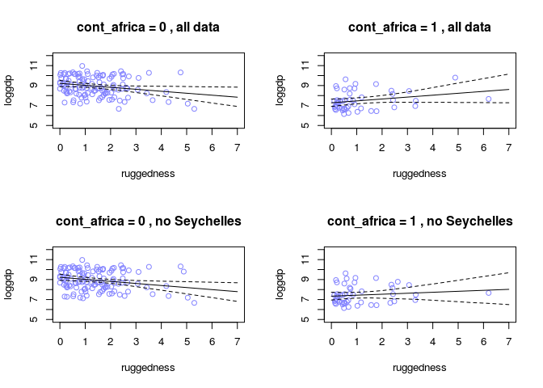

# chapter7
em  
June 5, 2016  


##7E1

1) Temperature

2) Field of study

3) Is the car broken?

##7E2
3

##7E3
1) Onion caramelization ~ Bt * temperature + Bw * moisture

2) Car speed ~ Bc * cylinders + Bi * fuel injector goodness

3) Political beliefs ~ Gp * parents' beliefs + Bf * friends' beliefs
Gp = Bp + Bpf * friends' beliefs
The Bpf term specifies whether the friends' beliefs matter or not.

4) Intelligence ~ Bs * socialness + Ba * appendages

##7M1


There is clearly an interaction between temperature, water, and shade.


##7M2


```r
blooms ~ a + bW*water + bS*shade + bWS*water*shade + bWST*temp*water*shade 

When temp is cool, temp=0. When temp is warm, temp = 1 and bWST*water*shade is equal to the sum of the other terms times 1.
```


##7M3

So, I think this biological interaction could be linear if raven population = wolf population + amount of food. However, the way it's described it seems like there's some sort of multiplicative thing happening since if there are no wolves, there are no ravens, such that raven population = wolf population * amount of food.


```
##7H1


```r
data(tulips)
d <- tulips

d$bed_id <- coerce_index(d$bed)
d$shade.c <- d$shade - mean(d$shade)
d$water.c <- d$water - mean(d$water)

m7.10 <- map(
  alist(
    blooms ~ dnorm(mu,sigma),
    mu <- a + bW*water.c + bS*shade.c + bWS*water.c*shade.c + bB*bed_id,
    a ~ dnorm(0,100),
    bW ~ dnorm(0,100),
    bS ~ dnorm(0,100),
    bB ~ dnorm(0,100),
    bWS ~ dnorm(0,100),
    sigma ~ dunif(0,100)
  ), data=d, start=list(a=mean(d$blooms), bW=0, bS = 0, bB = 0,sigma=sd(d$blooms)))

precis(m7.10)
```

```
##         Mean StdDev   5.5%  94.5%
## a      76.36  20.07  44.28 108.44
## bW     75.11   9.48  59.97  90.26
## bS    -41.23   9.47 -56.37 -26.08
## bB     26.11   9.31  11.22  40.99
## sigma  40.38   5.50  31.58  49.17
## bWS   -52.14  11.58 -70.65 -33.64
```

##7H2


```r
m7.9 <- map(
  alist(
    blooms ~ dnorm(mu,sigma),
    mu <- a + bW*water.c + bS*shade.c + bWS*water.c*shade.c,
    a ~ dnorm(0,100),
    bW ~ dnorm(0,100),
    bS ~ dnorm(0,100),
    bWS ~ dnorm(0,100),
    sigma ~ dunif(0,100)
  ), data=d, start=list(a=mean(d$blooms), bW=0, bS = 0, sigma=sd(d$blooms)))

coeftab(m7.9, m7.10)
```

```
##       m7.9    m7.10  
## a      127.96   76.36
## bW      74.96   75.11
## bS     -41.14  -41.23
## sigma   45.27   40.38
## bWS    -51.90  -52.14
## bB         NA   26.11
## nobs       27      27
```

```r
compare(m7.9, m7.10)
```

```
##        WAIC pWAIC dWAIC weight    SE  dSE
## m7.10 293.0   8.2   0.0   0.91  9.31   NA
## m7.9  297.7   7.4   4.7   0.09 10.85 6.86
```

Bed has a positive affect on the number of blooms, but it doesn't seem like this affects the coefficients for any of the other variables.

##7H3


```r
data(rugged)
d <- rugged[ complete.cases(rugged$rgdppc_2000) , ]
d$loggdp = log(d$rgdppc_2000)

m.full <- map(
alist(
loggdp ~ dnorm(mu,sigma),
mu <- a + bR*rugged + bAR*rugged*cont_africa + bA*cont_africa,
a ~ dnorm(0,100),
bA ~ dnorm(0,100),
bR ~ dnorm(0,100),
bAR ~ dnorm(0,100),
sigma ~ dunif(0,100)
),data=d,  start=list(a=mean(d$loggdp), bA=0, bR = 0, bAR=0,sigma=sd(d$loggdp)))

precis(m.full)
```

```
##        Mean StdDev  5.5% 94.5%
## a      9.22   0.14  9.00  9.44
## bA    -1.95   0.22 -2.31 -1.59
## bR    -0.20   0.08 -0.33 -0.08
## bAR    0.39   0.13  0.19  0.60
## sigma  0.93   0.05  0.85  1.01
```

```r
noSey = d[d$country != "Seychelles",]

m.noSey <- map(
alist(
loggdp ~ dnorm(mu,sigma),
mu <- a + bR*rugged + bAR*rugged*cont_africa + bA*cont_africa,
a ~ dnorm(0,100),
bA ~ dnorm(0,100),
bR ~ dnorm(0,100),
bAR ~ dnorm(0,100),
sigma ~ dunif(0,100)
),data=noSey,  start=list(a=mean(d$loggdp), bA=0, bR = 0, bAR=0,sigma=sd(d$loggdp)))

precis(m.noSey)
```

```
##        Mean StdDev  5.5% 94.5%
## a      9.22   0.14  9.00  9.44
## bA    -1.88   0.23 -2.24 -1.52
## bR    -0.20   0.08 -0.32 -0.08
## bAR    0.30   0.14  0.08  0.52
## sigma  0.93   0.05  0.84  1.01
```

```r
coeftab(m.full, m.noSey)
```

```
##       m.full  m.noSey
## a        9.22    9.22
## bA      -1.95   -1.88
## bR       -0.2    -0.2
## bAR      0.39    0.30
## sigma    0.93    0.93
## nobs      170     169
```

a) It still seems like the effect of ruggedness depends on continent and the relationship hasn't changed that much.


```r
par(mfrow=c(2,2))
rugged.seq = seq(0,7, by = 0.5)

for ( w in 0:1 ) {
dt <- d[d$cont_africa==w,]
plot( loggdp ~ rugged , data=dt , col=rangi2 ,
main=paste("cont_africa =",w, ", all data") , ylim=c(5,12) , xlim = c(0,7),xlab="ruggedness" )
mu <- link( m.full , data=data.frame(cont_africa=w,rugged=rugged.seq) )
mu.mean <- apply( mu , 2 , mean )
mu.PI <- apply( mu , 2 , PI , prob=0.97 )
lines( rugged.seq , mu.mean )
lines( rugged.seq , mu.PI[1,] , lty=2 )
lines( rugged.seq , mu.PI[2,] , lty=2 )
}
```

```
## [ 100 / 1000 ]
[ 200 / 1000 ]
[ 300 / 1000 ]
[ 400 / 1000 ]
[ 500 / 1000 ]
[ 600 / 1000 ]
[ 700 / 1000 ]
[ 800 / 1000 ]
[ 900 / 1000 ]
[ 1000 / 1000 ]
```

```
## [ 100 / 1000 ]
[ 200 / 1000 ]
[ 300 / 1000 ]
[ 400 / 1000 ]
[ 500 / 1000 ]
[ 600 / 1000 ]
[ 700 / 1000 ]
[ 800 / 1000 ]
[ 900 / 1000 ]
[ 1000 / 1000 ]
```

```r
for ( w in 0:1 ) {
dt <- d[noSey$cont_africa==w,]
plot( loggdp ~ rugged , data=dt , col=rangi2 ,
main=paste("cont_africa =",w, ", no Seychelles") , ylim=c(5,12) , xlim = c(0,7),xlab="ruggedness" )
mu <- link( m.noSey , data=data.frame(cont_africa=w,rugged=rugged.seq) )
mu.mean <- apply( mu , 2 , mean )
mu.PI <- apply( mu , 2 , PI , prob=0.97 )
lines( rugged.seq , mu.mean )
lines( rugged.seq , mu.PI[1,] , lty=2 )
lines( rugged.seq , mu.PI[2,] , lty=2 )
}
```

```
## [ 100 / 1000 ]
[ 200 / 1000 ]
[ 300 / 1000 ]
[ 400 / 1000 ]
[ 500 / 1000 ]
[ 600 / 1000 ]
[ 700 / 1000 ]
[ 800 / 1000 ]
[ 900 / 1000 ]
[ 1000 / 1000 ]
```

<!-- -->

```
## [ 100 / 1000 ]
[ 200 / 1000 ]
[ 300 / 1000 ]
[ 400 / 1000 ]
[ 500 / 1000 ]
[ 600 / 1000 ]
[ 700 / 1000 ]
[ 800 / 1000 ]
[ 900 / 1000 ]
[ 1000 / 1000 ]
```

b) the effect of ruggedness still depends on continent, but the affect in Africa seems a bit weaker.


```r
m.noSey.1 <- map(
alist(
loggdp ~ dnorm(mu,sigma),
mu <- a + bR*rugged,
a ~ dnorm(0,100),
bR ~ dnorm(0,100),
sigma ~ dunif(0,100)
),data=noSey,  start=list(a=mean(d$loggdp), bR = 0, sigma=sd(d$loggdp)))

m.noSey.2 <- map(
alist(
loggdp ~ dnorm(mu,sigma),
mu <- a + bR*rugged + bA*cont_africa,
a ~ dnorm(0,100),
bA ~ dnorm(0,100),
bR ~ dnorm(0,100),
sigma ~ dunif(0,100)
),data=noSey,  start=list(a=mean(d$loggdp), bA=0, bR = 0, sigma=sd(d$loggdp)))


m.noSey.3 <- map(
alist(
loggdp ~ dnorm(mu,sigma),
mu <- a + bR*rugged + bAR*rugged*cont_africa + bA*cont_africa,
a ~ dnorm(0,100),
bA ~ dnorm(0,100),
bR ~ dnorm(0,100),
bAR ~ dnorm(0,100),
sigma ~ dunif(0,100)
),data=noSey,  start=list(a=mean(d$loggdp), bA=0, bR = 0, bAR=0,sigma=sd(d$loggdp)))

compare(m.noSey.1, m.noSey.2, m.noSey.3)
```

```
##            WAIC pWAIC dWAIC weight    SE   dSE
## m.noSey.3 463.7   4.8   0.0   0.75 15.36    NA
## m.noSey.2 466.0   3.9   2.2   0.25 14.36  3.97
## m.noSey.1 536.1   2.6  72.4   0.00 13.40 15.90
```

##7H4


