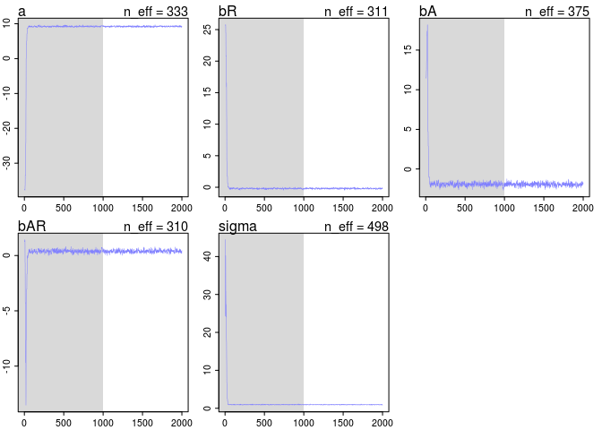

# chapter8homework
em  
July 13, 2016  


##8E1

Themetropolis algorithm requires that the proposal distribution is symmetric.

##8E2
Gibbs sampling is more efficient because of the conjugate pairs of priors and likelihoods, which means that there is an analytical solution for the paramter posterior distributions. 

##8E3

The Hamiltonian Monte Carlo can't handle non-continuous parameters

##8E4

The effective number of samples (n-eff) estimates the number of independent samples of the posterior distribution. This is not the same as the actual number of samples because Markov chains are autocorrelated. Figure 8.5 and code 8.14 show an example where the Markov chain ranges over really extreme values, so n-eff is quite small because when the chain is so far off from the mean, each value is similar to the one before it, and not independent

##8E5

Rhat should approach 1

##8E6

Not sure how to sketch here, but the trace plot should be relatively uniform and dense while a malfunctioning Markov chain will be skewed towards extremes.

##8M1


```r
library(rethinking)
```

```
## Loading required package: rstan
```

```
## Loading required package: ggplot2
```

```
## rstan (Version 2.9.0-3, packaged: 2016-02-11 15:54:41 UTC, GitRev: 05c3d0058b6a)
```

```
## For execution on a local, multicore CPU with excess RAM we recommend calling
## rstan_options(auto_write = TRUE)
## options(mc.cores = parallel::detectCores())
```

```
## Loading required package: parallel
```

```
## rethinking (Version 1.58)
```

```r
data(rugged)
d <- rugged
d$log_gdp <- log(d$rgdppc_2000)
dd <- d[ complete.cases(d$rgdppc_2000) , ]

dd.trim <- dd[ , c("log_gdp","rugged","cont_africa") ]


m8.1.stan <- map2stan(
alist(
log_gdp ~ dnorm( mu , sigma ) ,
mu <- a + bR*rugged + bA*cont_africa + bAR*rugged*cont_africa ,
a ~ dnorm(0,100),
bR ~ dnorm(0,10),
bA ~ dnorm(0,10),
bAR ~ dnorm(0,10),
sigma ~ dcauchy(0,2)
) ,
data=dd.trim )
```

```
## 
## SAMPLING FOR MODEL 'log_gdp ~ dnorm(mu, sigma)' NOW (CHAIN 1).
## 
## Chain 1, Iteration:    1 / 2000 [  0%]  (Warmup)
## Chain 1, Iteration:  200 / 2000 [ 10%]  (Warmup)
## Chain 1, Iteration:  400 / 2000 [ 20%]  (Warmup)
## Chain 1, Iteration:  600 / 2000 [ 30%]  (Warmup)
## Chain 1, Iteration:  800 / 2000 [ 40%]  (Warmup)
## Chain 1, Iteration: 1000 / 2000 [ 50%]  (Warmup)
## Chain 1, Iteration: 1001 / 2000 [ 50%]  (Sampling)
## Chain 1, Iteration: 1200 / 2000 [ 60%]  (Sampling)
## Chain 1, Iteration: 1400 / 2000 [ 70%]  (Sampling)
## Chain 1, Iteration: 1600 / 2000 [ 80%]  (Sampling)
## Chain 1, Iteration: 1800 / 2000 [ 90%]  (Sampling)
## Chain 1, Iteration: 2000 / 2000 [100%]  (Sampling)# 
## #  Elapsed Time: 0.167238 seconds (Warm-up)
## #                0.161796 seconds (Sampling)
## #                0.329034 seconds (Total)
## # 
## 
## SAMPLING FOR MODEL 'log_gdp ~ dnorm(mu, sigma)' NOW (CHAIN 1).
## 
## Chain 1, Iteration: 1 / 1 [100%]  (Sampling)# 
## #  Elapsed Time: 3e-06 seconds (Warm-up)
## #                7.5e-05 seconds (Sampling)
## #                7.8e-05 seconds (Total)
## #
```

```
## Computing WAIC
```

```
## Constructing posterior predictions
```

```
## [ 100 / 1000 ]
[ 200 / 1000 ]
[ 300 / 1000 ]
[ 400 / 1000 ]
[ 500 / 1000 ]
[ 600 / 1000 ]
[ 700 / 1000 ]
[ 800 / 1000 ]
[ 900 / 1000 ]
[ 1000 / 1000 ]
```

```r
precis(m8.1.stan)
```

```
##        Mean StdDev lower 0.89 upper 0.89 n_eff Rhat
## a      9.23   0.14       8.99       9.45   238    1
## bR    -0.21   0.08      -0.34      -0.09   241    1
## bA    -1.96   0.23      -2.34      -1.61   219    1
## bAR    0.40   0.14       0.21       0.63   244    1
## sigma  0.95   0.05       0.86       1.02   409    1
```

```r
plot(m8.1.stan)


m8.1.unif <- map2stan(
alist(
log_gdp ~ dnorm( mu , sigma ) ,
mu <- a + bR*rugged + bA*cont_africa + bAR*rugged*cont_africa ,
a ~ dnorm(0,100),
bR ~ dnorm(0,10),
bA ~ dnorm(0,10),
bAR ~ dnorm(0,10),
sigma ~ dunif(0,10)
) ,
data=dd.trim )
```

```
## 
## SAMPLING FOR MODEL 'log_gdp ~ dnorm(mu, sigma)' NOW (CHAIN 1).
## 
## Chain 1, Iteration:    1 / 2000 [  0%]  (Warmup)
## Chain 1, Iteration:  200 / 2000 [ 10%]  (Warmup)
## Chain 1, Iteration:  400 / 2000 [ 20%]  (Warmup)
## Chain 1, Iteration:  600 / 2000 [ 30%]  (Warmup)
## Chain 1, Iteration:  800 / 2000 [ 40%]  (Warmup)
## Chain 1, Iteration: 1000 / 2000 [ 50%]  (Warmup)
## Chain 1, Iteration: 1001 / 2000 [ 50%]  (Sampling)
## Chain 1, Iteration: 1200 / 2000 [ 60%]  (Sampling)
## Chain 1, Iteration: 1400 / 2000 [ 70%]  (Sampling)
## Chain 1, Iteration: 1600 / 2000 [ 80%]  (Sampling)
## Chain 1, Iteration: 1800 / 2000 [ 90%]  (Sampling)
## Chain 1, Iteration: 2000 / 2000 [100%]  (Sampling)# 
## #  Elapsed Time: 0.136721 seconds (Warm-up)
## #                0.144161 seconds (Sampling)
## #                0.280882 seconds (Total)
## # 
## 
## SAMPLING FOR MODEL 'log_gdp ~ dnorm(mu, sigma)' NOW (CHAIN 1).
## 
## Chain 1, Iteration: 1 / 1 [100%]  (Sampling)# 
## #  Elapsed Time: 2e-06 seconds (Warm-up)
## #                4.8e-05 seconds (Sampling)
## #                5e-05 seconds (Total)
## #
```

```
## Computing WAIC
## Constructing posterior predictions
```

```
## [ 100 / 1000 ]
[ 200 / 1000 ]
[ 300 / 1000 ]
[ 400 / 1000 ]
[ 500 / 1000 ]
[ 600 / 1000 ]
[ 700 / 1000 ]
[ 800 / 1000 ]
[ 900 / 1000 ]
[ 1000 / 1000 ]
```

```r
precis(m8.1.unif)
```

```
##        Mean StdDev lower 0.89 upper 0.89 n_eff Rhat
## a      9.22   0.14       9.00       9.44   283 1.00
## bR    -0.20   0.08      -0.31      -0.08   288 1.00
## bA    -1.95   0.23      -2.31      -1.57   247 1.00
## bAR    0.39   0.13       0.19       0.60   302 1.00
## sigma  0.95   0.06       0.87       1.04   345 1.01
```

```r
plot(m8.1.unif)
```

<!-- -->

```r
m8.1.exp <- map2stan(
alist(
log_gdp ~ dnorm( mu , sigma ) ,
mu <- a + bR*rugged + bA*cont_africa + bAR*rugged*cont_africa ,
a ~ dnorm(0,100),
bR ~ dnorm(0,10),
bA ~ dnorm(0,10),
bAR ~ dnorm(0,10),
sigma ~ dexp(1)
) ,
data=dd.trim )
```

```
## 
## SAMPLING FOR MODEL 'log_gdp ~ dnorm(mu, sigma)' NOW (CHAIN 1).
## 
## Chain 1, Iteration:    1 / 2000 [  0%]  (Warmup)
## Chain 1, Iteration:  200 / 2000 [ 10%]  (Warmup)
## Chain 1, Iteration:  400 / 2000 [ 20%]  (Warmup)
## Chain 1, Iteration:  600 / 2000 [ 30%]  (Warmup)
## Chain 1, Iteration:  800 / 2000 [ 40%]  (Warmup)
## Chain 1, Iteration: 1000 / 2000 [ 50%]  (Warmup)
## Chain 1, Iteration: 1001 / 2000 [ 50%]  (Sampling)
## Chain 1, Iteration: 1200 / 2000 [ 60%]  (Sampling)
## Chain 1, Iteration: 1400 / 2000 [ 70%]  (Sampling)
## Chain 1, Iteration: 1600 / 2000 [ 80%]  (Sampling)
## Chain 1, Iteration: 1800 / 2000 [ 90%]  (Sampling)
## Chain 1, Iteration: 2000 / 2000 [100%]  (Sampling)# 
## #  Elapsed Time: 0.145764 seconds (Warm-up)
## #                0.144722 seconds (Sampling)
## #                0.290486 seconds (Total)
## #
```

```
## The following numerical problems occured the indicated number of times after warmup on chain 1
```

```
##                                                                                 count
## Exception thrown at line 24: normal_log: Scale parameter is 0, but must be > 0!     2
```

```
## When a numerical problem occurs, the Metropolis proposal gets rejected.
```

```
## However, by design Metropolis proposals sometimes get rejected even when there are no numerical problems.
```

```
## Thus, if the number in the 'count' column is small, do not ask about this message on stan-users.
```

```
## 
## SAMPLING FOR MODEL 'log_gdp ~ dnorm(mu, sigma)' NOW (CHAIN 1).
## 
## Chain 1, Iteration: 1 / 1 [100%]  (Sampling)# 
## #  Elapsed Time: 1e-06 seconds (Warm-up)
## #                4.7e-05 seconds (Sampling)
## #                4.8e-05 seconds (Total)
## #
```

```
## Computing WAIC
```

```
## Constructing posterior predictions
```

```
## [ 100 / 1000 ]
[ 200 / 1000 ]
[ 300 / 1000 ]
[ 400 / 1000 ]
[ 500 / 1000 ]
[ 600 / 1000 ]
[ 700 / 1000 ]
[ 800 / 1000 ]
[ 900 / 1000 ]
[ 1000 / 1000 ]
```

```r
precis(m8.1.exp)
```

```
##        Mean StdDev lower 0.89 upper 0.89 n_eff Rhat
## a      9.23   0.14       9.00       9.44   222    1
## bR    -0.21   0.08      -0.33      -0.09   228    1
## bA    -1.96   0.22      -2.33      -1.63   288    1
## bAR    0.40   0.13       0.23       0.61   271    1
## sigma  0.95   0.05       0.87       1.04   404    1
```

```r
plot(m8.1.exp)
```

<!-- -->

```r
coeftab(m8.1.stan, m8.1.unif, m8.1.exp)
```

```
##       m8.1.stan m8.1.unif m8.1.exp
## a        9.23      9.22      9.23 
## bR      -0.21     -0.20     -0.21 
## bA      -1.96     -1.95     -1.96 
## bAR      0.40      0.39      0.40 
## sigma    0.95      0.95      0.95 
## nobs      170       170       170
```

```r
compare(m8.1.stan, m8.1.unif, m8.1.exp)
```

```
##            WAIC pWAIC dWAIC weight    SE  dSE
## m8.1.exp  468.9   4.9   0.0   0.38 14.82   NA
## m8.1.stan 469.2   5.1   0.3   0.33 14.88 0.25
## m8.1.unif 469.4   5.2   0.5   0.29 14.83 0.57
```

<!-- -->

So they're all pretty similar


##8M2

```r
m8.1.cauch1 <- map2stan(
alist(
log_gdp ~ dnorm( mu , sigma ) ,
mu <- a + bR*rugged + bA*cont_africa + bAR*rugged*cont_africa ,
a ~ dnorm(0,100),
bR ~ dnorm(0,10),
bA ~ dnorm(0,10),
bAR ~ dnorm(0,10),
sigma ~ dcauchy(0,1)
) ,
data=dd.trim )
```

```
## 
## SAMPLING FOR MODEL 'log_gdp ~ dnorm(mu, sigma)' NOW (CHAIN 1).
## 
## Chain 1, Iteration:    1 / 2000 [  0%]  (Warmup)
## Chain 1, Iteration:  200 / 2000 [ 10%]  (Warmup)
## Chain 1, Iteration:  400 / 2000 [ 20%]  (Warmup)
## Chain 1, Iteration:  600 / 2000 [ 30%]  (Warmup)
## Chain 1, Iteration:  800 / 2000 [ 40%]  (Warmup)
## Chain 1, Iteration: 1000 / 2000 [ 50%]  (Warmup)
## Chain 1, Iteration: 1001 / 2000 [ 50%]  (Sampling)
## Chain 1, Iteration: 1200 / 2000 [ 60%]  (Sampling)
## Chain 1, Iteration: 1400 / 2000 [ 70%]  (Sampling)
## Chain 1, Iteration: 1600 / 2000 [ 80%]  (Sampling)
## Chain 1, Iteration: 1800 / 2000 [ 90%]  (Sampling)
## Chain 1, Iteration: 2000 / 2000 [100%]  (Sampling)# 
## #  Elapsed Time: 0.177383 seconds (Warm-up)
## #                0.152494 seconds (Sampling)
## #                0.329877 seconds (Total)
## # 
## 
## SAMPLING FOR MODEL 'log_gdp ~ dnorm(mu, sigma)' NOW (CHAIN 1).
## 
## Chain 1, Iteration: 1 / 1 [100%]  (Sampling)# 
## #  Elapsed Time: 2e-06 seconds (Warm-up)
## #                5e-05 seconds (Sampling)
## #                5.2e-05 seconds (Total)
## #
```

```
## Computing WAIC
```

```
## Constructing posterior predictions
```

```
## [ 100 / 1000 ]
[ 200 / 1000 ]
[ 300 / 1000 ]
[ 400 / 1000 ]
[ 500 / 1000 ]
[ 600 / 1000 ]
[ 700 / 1000 ]
[ 800 / 1000 ]
[ 900 / 1000 ]
[ 1000 / 1000 ]
```

```r
precis(m8.1.cauch1)
```

```
##        Mean StdDev lower 0.89 upper 0.89 n_eff Rhat
## a      9.23   0.13       9.00       9.43   342 1.01
## bR    -0.21   0.07      -0.33      -0.10   325 1.01
## bA    -1.95   0.23      -2.30      -1.57   290 1.02
## bAR    0.39   0.13       0.18       0.60   305 1.02
## sigma  0.95   0.05       0.87       1.03   422 1.00
```

```r
plot(m8.1.cauch1)


m8.1.cauch.5 <- map2stan(
alist(
log_gdp ~ dnorm( mu , sigma ) ,
mu <- a + bR*rugged + bA*cont_africa + bAR*rugged*cont_africa ,
a ~ dnorm(0,100),
bR ~ dnorm(0,10),
bA ~ dnorm(0,10),
bAR ~ dnorm(0,10),
sigma ~ dcauchy(0,0.5)
) ,
data=dd.trim )
```

```
## 
## SAMPLING FOR MODEL 'log_gdp ~ dnorm(mu, sigma)' NOW (CHAIN 1).
## 
## Chain 1, Iteration:    1 / 2000 [  0%]  (Warmup)
## Chain 1, Iteration:  200 / 2000 [ 10%]  (Warmup)
## Chain 1, Iteration:  400 / 2000 [ 20%]  (Warmup)
## Chain 1, Iteration:  600 / 2000 [ 30%]  (Warmup)
## Chain 1, Iteration:  800 / 2000 [ 40%]  (Warmup)
## Chain 1, Iteration: 1000 / 2000 [ 50%]  (Warmup)
## Chain 1, Iteration: 1001 / 2000 [ 50%]  (Sampling)
## Chain 1, Iteration: 1200 / 2000 [ 60%]  (Sampling)
## Chain 1, Iteration: 1400 / 2000 [ 70%]  (Sampling)
## Chain 1, Iteration: 1600 / 2000 [ 80%]  (Sampling)
## Chain 1, Iteration: 1800 / 2000 [ 90%]  (Sampling)
## Chain 1, Iteration: 2000 / 2000 [100%]  (Sampling)# 
## #  Elapsed Time: 0.142922 seconds (Warm-up)
## #                0.130665 seconds (Sampling)
## #                0.273587 seconds (Total)
## # 
## 
## SAMPLING FOR MODEL 'log_gdp ~ dnorm(mu, sigma)' NOW (CHAIN 1).
## 
## Chain 1, Iteration: 1 / 1 [100%]  (Sampling)# 
## #  Elapsed Time: 2e-06 seconds (Warm-up)
## #                4.7e-05 seconds (Sampling)
## #                4.9e-05 seconds (Total)
## #
```

```
## Computing WAIC
## Constructing posterior predictions
```

```
## [ 100 / 1000 ]
[ 200 / 1000 ]
[ 300 / 1000 ]
[ 400 / 1000 ]
[ 500 / 1000 ]
[ 600 / 1000 ]
[ 700 / 1000 ]
[ 800 / 1000 ]
[ 900 / 1000 ]
[ 1000 / 1000 ]
```

```r
precis(m8.1.cauch.5)
```

```
##        Mean StdDev lower 0.89 upper 0.89 n_eff Rhat
## a      9.21   0.14       8.99       9.42   118 1.01
## bR    -0.19   0.08      -0.32      -0.06   155 1.01
## bA    -1.94   0.24      -2.36      -1.58   119 1.01
## bAR    0.39   0.14       0.18       0.61   164 1.01
## sigma  0.94   0.05       0.88       1.04   424 1.00
```

```r
plot(m8.1.cauch.5)
```

<!-- -->

```r
m8.1.cauch.1 <- map2stan(
alist(
log_gdp ~ dnorm( mu , sigma ) ,
mu <- a + bR*rugged + bA*cont_africa + bAR*rugged*cont_africa ,
a ~ dnorm(0,100),
bR ~ dnorm(0,10),
bA ~ dnorm(0,10),
bAR ~ dnorm(0,10),
sigma ~ dcauchy(0,0.1)
) ,
data=dd.trim )
```

```
## 
## SAMPLING FOR MODEL 'log_gdp ~ dnorm(mu, sigma)' NOW (CHAIN 1).
## 
## Chain 1, Iteration:    1 / 2000 [  0%]  (Warmup)
## Chain 1, Iteration:  200 / 2000 [ 10%]  (Warmup)
## Chain 1, Iteration:  400 / 2000 [ 20%]  (Warmup)
## Chain 1, Iteration:  600 / 2000 [ 30%]  (Warmup)
## Chain 1, Iteration:  800 / 2000 [ 40%]  (Warmup)
## Chain 1, Iteration: 1000 / 2000 [ 50%]  (Warmup)
## Chain 1, Iteration: 1001 / 2000 [ 50%]  (Sampling)
## Chain 1, Iteration: 1200 / 2000 [ 60%]  (Sampling)
## Chain 1, Iteration: 1400 / 2000 [ 70%]  (Sampling)
## Chain 1, Iteration: 1600 / 2000 [ 80%]  (Sampling)
## Chain 1, Iteration: 1800 / 2000 [ 90%]  (Sampling)
## Chain 1, Iteration: 2000 / 2000 [100%]  (Sampling)# 
## #  Elapsed Time: 0.134116 seconds (Warm-up)
## #                0.120302 seconds (Sampling)
## #                0.254418 seconds (Total)
## # 
## 
## SAMPLING FOR MODEL 'log_gdp ~ dnorm(mu, sigma)' NOW (CHAIN 1).
## 
## Chain 1, Iteration: 1 / 1 [100%]  (Sampling)# 
## #  Elapsed Time: 2e-06 seconds (Warm-up)
## #                4.6e-05 seconds (Sampling)
## #                4.8e-05 seconds (Total)
## #
```

```
## Computing WAIC
## Constructing posterior predictions
```

```
## [ 100 / 1000 ]
[ 200 / 1000 ]
[ 300 / 1000 ]
[ 400 / 1000 ]
[ 500 / 1000 ]
[ 600 / 1000 ]
[ 700 / 1000 ]
[ 800 / 1000 ]
[ 900 / 1000 ]
[ 1000 / 1000 ]
```

```r
precis(m8.1.cauch.1)
```

```
##        Mean StdDev lower 0.89 upper 0.89 n_eff Rhat
## a      9.22   0.14       9.00       9.43   217    1
## bR    -0.20   0.08      -0.33      -0.09   244    1
## bA    -1.95   0.23      -2.31      -1.59   270    1
## bAR    0.39   0.13       0.16       0.59   297    1
## sigma  0.94   0.05       0.87       1.03   444    1
```

```r
plot(m8.1.cauch.1)
```

<!-- -->

```r
m8.1.exp.5 <- map2stan(
alist(
log_gdp ~ dnorm( mu , sigma ) ,
mu <- a + bR*rugged + bA*cont_africa + bAR*rugged*cont_africa ,
a ~ dnorm(0,100),
bR ~ dnorm(0,10),
bA ~ dnorm(0,10),
bAR ~ dnorm(0,10),
sigma ~ dexp(0.5)
) ,
data=dd.trim )
```

```
## 
## SAMPLING FOR MODEL 'log_gdp ~ dnorm(mu, sigma)' NOW (CHAIN 1).
## 
## Chain 1, Iteration:    1 / 2000 [  0%]  (Warmup)
## Chain 1, Iteration:  200 / 2000 [ 10%]  (Warmup)
## Chain 1, Iteration:  400 / 2000 [ 20%]  (Warmup)
## Chain 1, Iteration:  600 / 2000 [ 30%]  (Warmup)
## Chain 1, Iteration:  800 / 2000 [ 40%]  (Warmup)
## Chain 1, Iteration: 1000 / 2000 [ 50%]  (Warmup)
## Chain 1, Iteration: 1001 / 2000 [ 50%]  (Sampling)
## Chain 1, Iteration: 1200 / 2000 [ 60%]  (Sampling)
## Chain 1, Iteration: 1400 / 2000 [ 70%]  (Sampling)
## Chain 1, Iteration: 1600 / 2000 [ 80%]  (Sampling)
## Chain 1, Iteration: 1800 / 2000 [ 90%]  (Sampling)
## Chain 1, Iteration: 2000 / 2000 [100%]  (Sampling)# 
## #  Elapsed Time: 0.150752 seconds (Warm-up)
## #                0.116585 seconds (Sampling)
## #                0.267337 seconds (Total)
## #
```

```
## The following numerical problems occured the indicated number of times after warmup on chain 1
```

```
##                                                                                 count
## Exception thrown at line 24: normal_log: Scale parameter is 0, but must be > 0!     2
```

```
## When a numerical problem occurs, the Metropolis proposal gets rejected.
```

```
## However, by design Metropolis proposals sometimes get rejected even when there are no numerical problems.
```

```
## Thus, if the number in the 'count' column is small, do not ask about this message on stan-users.
```

```
## 
## SAMPLING FOR MODEL 'log_gdp ~ dnorm(mu, sigma)' NOW (CHAIN 1).
## 
## Chain 1, Iteration: 1 / 1 [100%]  (Sampling)# 
## #  Elapsed Time: 2e-06 seconds (Warm-up)
## #                5.3e-05 seconds (Sampling)
## #                5.5e-05 seconds (Total)
## #
```

```
## Computing WAIC
```

```
## Constructing posterior predictions
```

```
## [ 100 / 1000 ]
[ 200 / 1000 ]
[ 300 / 1000 ]
[ 400 / 1000 ]
[ 500 / 1000 ]
[ 600 / 1000 ]
[ 700 / 1000 ]
[ 800 / 1000 ]
[ 900 / 1000 ]
[ 1000 / 1000 ]
```

```r
precis(m8.1.exp.5)
```

```
##        Mean StdDev lower 0.89 upper 0.89 n_eff Rhat
## a      9.22   0.14       9.00       9.44   179 1.01
## bR    -0.20   0.08      -0.32      -0.07   162 1.02
## bA    -1.94   0.24      -2.31      -1.55   230 1.00
## bAR    0.39   0.13       0.19       0.62   215 1.01
## sigma  0.95   0.06       0.86       1.04   524 1.00
```

```r
plot(m8.1.exp.5)
```

<!-- -->

```r
m8.1.exp.1 <- map2stan(
alist(
log_gdp ~ dnorm( mu , sigma ) ,
mu <- a + bR*rugged + bA*cont_africa + bAR*rugged*cont_africa ,
a ~ dnorm(0,100),
bR ~ dnorm(0,10),
bA ~ dnorm(0,10),
bAR ~ dnorm(0,10),
sigma ~ dexp(0.1)
) ,
data=dd.trim )
```

```
## 
## SAMPLING FOR MODEL 'log_gdp ~ dnorm(mu, sigma)' NOW (CHAIN 1).
## 
## Chain 1, Iteration:    1 / 2000 [  0%]  (Warmup)
## Chain 1, Iteration:  200 / 2000 [ 10%]  (Warmup)
## Chain 1, Iteration:  400 / 2000 [ 20%]  (Warmup)
## Chain 1, Iteration:  600 / 2000 [ 30%]  (Warmup)
## Chain 1, Iteration:  800 / 2000 [ 40%]  (Warmup)
## Chain 1, Iteration: 1000 / 2000 [ 50%]  (Warmup)
## Chain 1, Iteration: 1001 / 2000 [ 50%]  (Sampling)
## Chain 1, Iteration: 1200 / 2000 [ 60%]  (Sampling)
## Chain 1, Iteration: 1400 / 2000 [ 70%]  (Sampling)
## Chain 1, Iteration: 1600 / 2000 [ 80%]  (Sampling)
## Chain 1, Iteration: 1800 / 2000 [ 90%]  (Sampling)
## Chain 1, Iteration: 2000 / 2000 [100%]  (Sampling)# 
## #  Elapsed Time: 0.190569 seconds (Warm-up)
## #                0.140305 seconds (Sampling)
## #                0.330874 seconds (Total)
## #
```

```
## The following numerical problems occured the indicated number of times after warmup on chain 1
```

```
##                                                                                 count
## Exception thrown at line 24: normal_log: Scale parameter is 0, but must be > 0!     2
```

```
## When a numerical problem occurs, the Metropolis proposal gets rejected.
```

```
## However, by design Metropolis proposals sometimes get rejected even when there are no numerical problems.
```

```
## Thus, if the number in the 'count' column is small, do not ask about this message on stan-users.
```

```
## 
## SAMPLING FOR MODEL 'log_gdp ~ dnorm(mu, sigma)' NOW (CHAIN 1).
## 
## Chain 1, Iteration: 1 / 1 [100%]  (Sampling)# 
## #  Elapsed Time: 2e-06 seconds (Warm-up)
## #                4.6e-05 seconds (Sampling)
## #                4.8e-05 seconds (Total)
## #
```

```
## Computing WAIC
```

```
## Constructing posterior predictions
```

```
## [ 100 / 1000 ]
[ 200 / 1000 ]
[ 300 / 1000 ]
[ 400 / 1000 ]
[ 500 / 1000 ]
[ 600 / 1000 ]
[ 700 / 1000 ]
[ 800 / 1000 ]
[ 900 / 1000 ]
[ 1000 / 1000 ]
```

```r
precis(m8.1.exp.1)
```

```
##        Mean StdDev lower 0.89 upper 0.89 n_eff Rhat
## a      9.22   0.14       8.99       9.44   227 1.01
## bR    -0.21   0.08      -0.33      -0.08   252 1.01
## bA    -1.96   0.23      -2.33      -1.61   288 1.00
## bAR    0.40   0.14       0.19       0.61   280 1.01
## sigma  0.95   0.05       0.87       1.03   359 1.00
```

```r
plot(m8.1.exp.1)
```

<!-- -->

```r
coeftab(m8.1.stan, m8.1.cauch1, m8.1.cauch.5, m8.1.cauch.1)
```

```
##       m8.1.stan m8.1.cauch1 m8.1.cauch.5 m8.1.cauch.1
## a        9.23      9.23        9.21         9.22     
## bR      -0.21     -0.21       -0.19        -0.20     
## bA      -1.96     -1.95       -1.94        -1.95     
## bAR      0.40      0.39        0.39         0.39     
## sigma    0.95      0.95        0.94         0.94     
## nobs      170       170         170          170
```

```r
coeftab(m8.1.exp, m8.1.exp.5, m8.1.exp.1)
```

```
##       m8.1.exp m8.1.exp.5 m8.1.exp.1
## a        9.23     9.22       9.22   
## bR      -0.21    -0.20      -0.21   
## bA      -1.96    -1.94      -1.96   
## bAR      0.40     0.39       0.40   
## sigma    0.95     0.95       0.95   
## nobs      170      170        170
```

```r
compare(m8.1.stan, m8.1.cauch1, m8.1.cauch.5, m8.1.cauch.1)
```

```
##               WAIC pWAIC dWAIC weight    SE  dSE
## m8.1.cauch1  469.2   5.0   0.0   0.26 14.81   NA
## m8.1.cauch.1 469.2   5.1   0.0   0.26 14.98 0.20
## m8.1.stan    469.2   5.1   0.1   0.26 14.88 0.16
## m8.1.cauch.5 469.6   5.3   0.4   0.22 14.95 0.51
```

```r
compare(m8.1.exp, m8.1.exp.5, m8.1.exp.1)
```

```
##             WAIC pWAIC dWAIC weight    SE  dSE
## m8.1.exp   468.9   4.9   0.0   0.39 14.82   NA
## m8.1.exp.5 469.2   5.0   0.3   0.34 14.80 0.47
## m8.1.exp.1 469.7   5.3   0.7   0.27 14.84 0.43
```

<!-- -->

There really doesn't seem to be much effect here

###8M3

```r
m8.1.w2500 <- map2stan(
alist(
log_gdp ~ dnorm( mu , sigma ) ,
mu <- a + bR*rugged + bA*cont_africa + bAR*rugged*cont_africa ,
a ~ dnorm(0,100),
bR ~ dnorm(0,10),
bA ~ dnorm(0,10),
bAR ~ dnorm(0,10),
sigma ~ dcauchy(0,2)
) ,
data=dd.trim, iter=4500, warmup=2500) #default is 1000
```

```
## 
## SAMPLING FOR MODEL 'log_gdp ~ dnorm(mu, sigma)' NOW (CHAIN 1).
## 
## Chain 1, Iteration:    1 / 4500 [  0%]  (Warmup)
## Chain 1, Iteration:  450 / 4500 [ 10%]  (Warmup)
## Chain 1, Iteration:  900 / 4500 [ 20%]  (Warmup)
## Chain 1, Iteration: 1350 / 4500 [ 30%]  (Warmup)
## Chain 1, Iteration: 1800 / 4500 [ 40%]  (Warmup)
## Chain 1, Iteration: 2250 / 4500 [ 50%]  (Warmup)
## Chain 1, Iteration: 2501 / 4500 [ 55%]  (Sampling)
## Chain 1, Iteration: 2950 / 4500 [ 65%]  (Sampling)
## Chain 1, Iteration: 3400 / 4500 [ 75%]  (Sampling)
## Chain 1, Iteration: 3850 / 4500 [ 85%]  (Sampling)
## Chain 1, Iteration: 4300 / 4500 [ 95%]  (Sampling)
## Chain 1, Iteration: 4500 / 4500 [100%]  (Sampling)# 
## #  Elapsed Time: 0.314525 seconds (Warm-up)
## #                0.279545 seconds (Sampling)
## #                0.59407 seconds (Total)
## # 
## 
## SAMPLING FOR MODEL 'log_gdp ~ dnorm(mu, sigma)' NOW (CHAIN 1).
## 
## Chain 1, Iteration: 1 / 1 [100%]  (Sampling)# 
## #  Elapsed Time: 1e-06 seconds (Warm-up)
## #                4.7e-05 seconds (Sampling)
## #                4.8e-05 seconds (Total)
## #
```

```
## Computing WAIC
```

```
## Constructing posterior predictions
```

```
## [ 200 / 2000 ]
[ 400 / 2000 ]
[ 600 / 2000 ]
[ 800 / 2000 ]
[ 1000 / 2000 ]
[ 1200 / 2000 ]
[ 1400 / 2000 ]
[ 1600 / 2000 ]
[ 1800 / 2000 ]
[ 2000 / 2000 ]
```

```r
precis(m8.1.w2500)
```

```
##        Mean StdDev lower 0.89 upper 0.89 n_eff Rhat
## a      9.22   0.13       9.01       9.43   782    1
## bR    -0.20   0.07      -0.31      -0.07   628    1
## bA    -1.94   0.22      -2.30      -1.60   659    1
## bAR    0.39   0.13       0.19       0.60   587    1
## sigma  0.95   0.05       0.87       1.03   845    1
```

```r
m8.1.w25 <- map2stan(
alist(
log_gdp ~ dnorm( mu , sigma ) ,
mu <- a + bR*rugged + bA*cont_africa + bAR*rugged*cont_africa ,
a ~ dnorm(0,100),
bR ~ dnorm(0,10),
bA ~ dnorm(0,10),
bAR ~ dnorm(0,10),
sigma ~ dcauchy(0,2)
) ,
data=dd.trim, iter=1025,warmup=25) #default is 1000
```

```
## 
## SAMPLING FOR MODEL 'log_gdp ~ dnorm(mu, sigma)' NOW (CHAIN 1).
## 
## Chain 1, Iteration:    1 / 1025 [  0%]  (Warmup)
## Chain 1, Iteration:   26 / 1025 [  2%]  (Sampling)
## Chain 1, Iteration:  127 / 1025 [ 12%]  (Sampling)
## Chain 1, Iteration:  229 / 1025 [ 22%]  (Sampling)
## Chain 1, Iteration:  331 / 1025 [ 32%]  (Sampling)
## Chain 1, Iteration:  433 / 1025 [ 42%]  (Sampling)
## Chain 1, Iteration:  535 / 1025 [ 52%]  (Sampling)
## Chain 1, Iteration:  637 / 1025 [ 62%]  (Sampling)
## Chain 1, Iteration:  739 / 1025 [ 72%]  (Sampling)
## Chain 1, Iteration:  841 / 1025 [ 82%]  (Sampling)
## Chain 1, Iteration:  943 / 1025 [ 92%]  (Sampling)
## Chain 1, Iteration: 1025 / 1025 [100%]  (Sampling)# 
## #  Elapsed Time: 0.013093 seconds (Warm-up)
## #                0.107886 seconds (Sampling)
## #                0.120979 seconds (Total)
## # 
## 
## SAMPLING FOR MODEL 'log_gdp ~ dnorm(mu, sigma)' NOW (CHAIN 1).
## 
## Chain 1, Iteration: 1 / 1 [100%]  (Sampling)# 
## #  Elapsed Time: 1e-06 seconds (Warm-up)
## #                5.4e-05 seconds (Sampling)
## #                5.5e-05 seconds (Total)
## #
```

```
## Computing WAIC
## Constructing posterior predictions
```

```
## [ 100 / 1000 ]
[ 200 / 1000 ]
[ 300 / 1000 ]
[ 400 / 1000 ]
[ 500 / 1000 ]
[ 600 / 1000 ]
[ 700 / 1000 ]
[ 800 / 1000 ]
[ 900 / 1000 ]
[ 1000 / 1000 ]
```

```r
precis(m8.1.w25)
```

```
##        Mean StdDev lower 0.89 upper 0.89 n_eff Rhat
## a      9.31   0.83       8.96       9.46    87 1.01
## bR    -0.23   0.33      -0.32      -0.06    88 1.01
## bA    -1.98   0.35      -2.37      -1.57    97 1.00
## bAR    0.39   0.18       0.17       0.61   188 1.01
## sigma  1.00   0.46       0.87       1.04    92 1.01
```

```r
coeftab(m8.1.w25, m8.1.stan, m8.1.w2500)
```

```
##       m8.1.w25 m8.1.stan m8.1.w2500
## a        9.31     9.23      9.22   
## bR      -0.23    -0.21     -0.20   
## bA      -1.98    -1.96     -1.94   
## bAR      0.39     0.40      0.39   
## sigma    1.00     0.95      0.95   
## nobs      170      170       170
```

```r
compare(m8.1.w25, m8.1.stan, m8.1.w2500)
```

```
##             WAIC pWAIC dWAIC weight    SE  dSE
## m8.1.w2500 468.9   4.9   0.0   0.54 14.78   NA
## m8.1.stan  469.2   5.1   0.3   0.46 14.88 0.27
## m8.1.w25   485.2  11.5  16.3   0.00 14.55 1.36
```

```r
plot(m8.1.stan)
plot(m8.1.w2500)
```

<!-- -->

```r
plot(m8.1.w25)
```

<!-- --><!-- -->

So 25 is clearly not enough, but 2500 isn't that much better than 1000.
