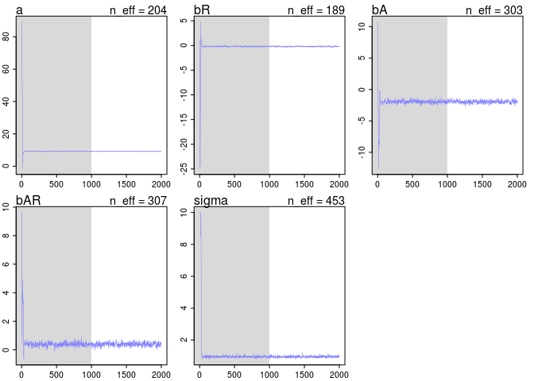
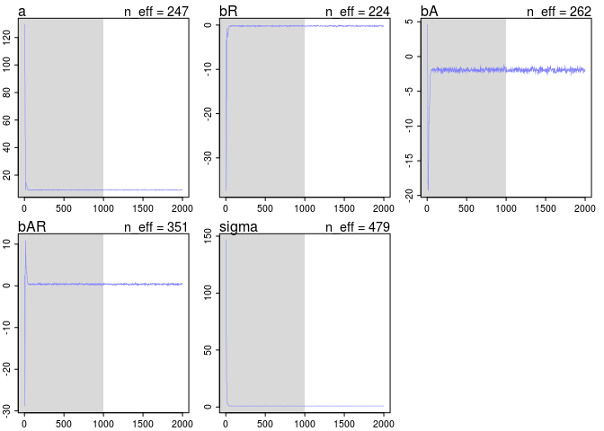

# chapter8homework
em  
July 13, 2016  


##8E1

Themetropolis algorithm requires that the proposal distribution is symmetric.

##8E2
Gibbs sampling is more efficient because of the conjugate pairs of priors and likelihoods, which means that there is an analytical solution for the paramter posterior distributions. 

##8E3

The Hamiltonian Monte Carlo can't handle non-continuous parameters

##8E4

The effective number of samples (n-eff) estimates the number of independent samples of the posterior distribution. This is not the same as the actual number of samples because Markov chains are autocorrelated. Figure 8.5 and code 8.14 show an example where the Markov chain ranges over really extreme values, so n-eff is quite small because when the chain is so far off from the mean, each value is similar to the one before it, and not independent

##8E5

Rhat should approach 1

##8E6

Not sure how to sketch here, but the trace plot should be relatively uniform and dense while a malfunctioning Markov chain will be skewed towards extremes.

##8M1


```r
data(rugged)
d <- rugged
d$log_gdp <- log(d$rgdppc_2000)
dd <- d[ complete.cases(d$rgdppc_2000) , ]

dd.trim <- dd[ , c("log_gdp","rugged","cont_africa") ]


m8.1.stan <- map2stan(
alist(
log_gdp ~ dnorm( mu , sigma ) ,
mu <- a + bR*rugged + bA*cont_africa + bAR*rugged*cont_africa ,
a ~ dnorm(0,100),
bR ~ dnorm(0,10),
bA ~ dnorm(0,10),
bAR ~ dnorm(0,10),
sigma ~ dcauchy(0,2)
) ,
data=dd.trim )
```

```
## 
## SAMPLING FOR MODEL 'log_gdp ~ dnorm(mu, sigma)' NOW (CHAIN 1).
## 
## Chain 1, Iteration:    1 / 2000 [  0%]  (Warmup)
## Chain 1, Iteration:  200 / 2000 [ 10%]  (Warmup)
## Chain 1, Iteration:  400 / 2000 [ 20%]  (Warmup)
## Chain 1, Iteration:  600 / 2000 [ 30%]  (Warmup)
## Chain 1, Iteration:  800 / 2000 [ 40%]  (Warmup)
## Chain 1, Iteration: 1000 / 2000 [ 50%]  (Warmup)
## Chain 1, Iteration: 1001 / 2000 [ 50%]  (Sampling)
## Chain 1, Iteration: 1200 / 2000 [ 60%]  (Sampling)
## Chain 1, Iteration: 1400 / 2000 [ 70%]  (Sampling)
## Chain 1, Iteration: 1600 / 2000 [ 80%]  (Sampling)
## Chain 1, Iteration: 1800 / 2000 [ 90%]  (Sampling)
## Chain 1, Iteration: 2000 / 2000 [100%]  (Sampling)# 
## #  Elapsed Time: 0.185102 seconds (Warm-up)
## #                0.14421 seconds (Sampling)
## #                0.329312 seconds (Total)
## # 
## 
## SAMPLING FOR MODEL 'log_gdp ~ dnorm(mu, sigma)' NOW (CHAIN 1).
## 
## Chain 1, Iteration: 1 / 1 [100%]  (Sampling)# 
## #  Elapsed Time: 1e-06 seconds (Warm-up)
## #                5.3e-05 seconds (Sampling)
## #                5.4e-05 seconds (Total)
## #
```

```
## Computing WAIC
```

```
## Constructing posterior predictions
```

```
## [ 100 / 1000 ]
[ 200 / 1000 ]
[ 300 / 1000 ]
[ 400 / 1000 ]
[ 500 / 1000 ]
[ 600 / 1000 ]
[ 700 / 1000 ]
[ 800 / 1000 ]
[ 900 / 1000 ]
[ 1000 / 1000 ]
```

```r
precis(m8.1.stan)
```

```
##        Mean StdDev lower 0.89 upper 0.89 n_eff Rhat
## a      9.21   0.14       9.01       9.44   313    1
## bR    -0.20   0.08      -0.34      -0.09   296    1
## bA    -1.93   0.22      -2.30      -1.59   342    1
## bAR    0.39   0.13       0.19       0.61   364    1
## sigma  0.95   0.05       0.86       1.03   453    1
```

```r
plot(m8.1.stan)


m8.1.unif <- map2stan(
alist(
log_gdp ~ dnorm( mu , sigma ) ,
mu <- a + bR*rugged + bA*cont_africa + bAR*rugged*cont_africa ,
a ~ dnorm(0,100),
bR ~ dnorm(0,10),
bA ~ dnorm(0,10),
bAR ~ dnorm(0,10),
sigma ~ dunif(0,10)
) ,
data=dd.trim )
```

```
## 
## SAMPLING FOR MODEL 'log_gdp ~ dnorm(mu, sigma)' NOW (CHAIN 1).
## 
## Chain 1, Iteration:    1 / 2000 [  0%]  (Warmup)
## Chain 1, Iteration:  200 / 2000 [ 10%]  (Warmup)
## Chain 1, Iteration:  400 / 2000 [ 20%]  (Warmup)
## Chain 1, Iteration:  600 / 2000 [ 30%]  (Warmup)
## Chain 1, Iteration:  800 / 2000 [ 40%]  (Warmup)
## Chain 1, Iteration: 1000 / 2000 [ 50%]  (Warmup)
## Chain 1, Iteration: 1001 / 2000 [ 50%]  (Sampling)
## Chain 1, Iteration: 1200 / 2000 [ 60%]  (Sampling)
## Chain 1, Iteration: 1400 / 2000 [ 70%]  (Sampling)
## Chain 1, Iteration: 1600 / 2000 [ 80%]  (Sampling)
## Chain 1, Iteration: 1800 / 2000 [ 90%]  (Sampling)
## Chain 1, Iteration: 2000 / 2000 [100%]  (Sampling)# 
## #  Elapsed Time: 0.148716 seconds (Warm-up)
## #                0.126967 seconds (Sampling)
## #                0.275683 seconds (Total)
## # 
## 
## SAMPLING FOR MODEL 'log_gdp ~ dnorm(mu, sigma)' NOW (CHAIN 1).
## 
## Chain 1, Iteration: 1 / 1 [100%]  (Sampling)# 
## #  Elapsed Time: 2e-06 seconds (Warm-up)
## #                4.8e-05 seconds (Sampling)
## #                5e-05 seconds (Total)
## #
```

```
## Computing WAIC
## Constructing posterior predictions
```

```
## [ 100 / 1000 ]
[ 200 / 1000 ]
[ 300 / 1000 ]
[ 400 / 1000 ]
[ 500 / 1000 ]
[ 600 / 1000 ]
[ 700 / 1000 ]
[ 800 / 1000 ]
[ 900 / 1000 ]
[ 1000 / 1000 ]
```

```r
precis(m8.1.unif)
```

```
##        Mean StdDev lower 0.89 upper 0.89 n_eff Rhat
## a      9.23   0.14       9.02       9.44   204    1
## bR    -0.21   0.08      -0.32      -0.08   189    1
## bA    -1.95   0.23      -2.35      -1.60   303    1
## bAR    0.40   0.13       0.18       0.60   307    1
## sigma  0.95   0.05       0.87       1.04   453    1
```

```r
plot(m8.1.unif)
```

<!-- -->

```r
m8.1.exp <- map2stan(
alist(
log_gdp ~ dnorm( mu , sigma ) ,
mu <- a + bR*rugged + bA*cont_africa + bAR*rugged*cont_africa ,
a ~ dnorm(0,100),
bR ~ dnorm(0,10),
bA ~ dnorm(0,10),
bAR ~ dnorm(0,10),
sigma ~ dexp(1)
) ,
data=dd.trim )
```

```
## 
## SAMPLING FOR MODEL 'log_gdp ~ dnorm(mu, sigma)' NOW (CHAIN 1).
## 
## Chain 1, Iteration:    1 / 2000 [  0%]  (Warmup)
## Chain 1, Iteration:  200 / 2000 [ 10%]  (Warmup)
## Chain 1, Iteration:  400 / 2000 [ 20%]  (Warmup)
## Chain 1, Iteration:  600 / 2000 [ 30%]  (Warmup)
## Chain 1, Iteration:  800 / 2000 [ 40%]  (Warmup)
## Chain 1, Iteration: 1000 / 2000 [ 50%]  (Warmup)
## Chain 1, Iteration: 1001 / 2000 [ 50%]  (Sampling)
## Chain 1, Iteration: 1200 / 2000 [ 60%]  (Sampling)
## Chain 1, Iteration: 1400 / 2000 [ 70%]  (Sampling)
## Chain 1, Iteration: 1600 / 2000 [ 80%]  (Sampling)
## Chain 1, Iteration: 1800 / 2000 [ 90%]  (Sampling)
## Chain 1, Iteration: 2000 / 2000 [100%]  (Sampling)# 
## #  Elapsed Time: 0.135744 seconds (Warm-up)
## #                0.141079 seconds (Sampling)
## #                0.276823 seconds (Total)
## # 
## 
## SAMPLING FOR MODEL 'log_gdp ~ dnorm(mu, sigma)' NOW (CHAIN 1).
## 
## Chain 1, Iteration: 1 / 1 [100%]  (Sampling)# 
## #  Elapsed Time: 1e-06 seconds (Warm-up)
## #                5.4e-05 seconds (Sampling)
## #                5.5e-05 seconds (Total)
## #
```

```
## Computing WAIC
## Constructing posterior predictions
```

```
## [ 100 / 1000 ]
[ 200 / 1000 ]
[ 300 / 1000 ]
[ 400 / 1000 ]
[ 500 / 1000 ]
[ 600 / 1000 ]
[ 700 / 1000 ]
[ 800 / 1000 ]
[ 900 / 1000 ]
[ 1000 / 1000 ]
```

```r
precis(m8.1.exp)
```

```
##        Mean StdDev lower 0.89 upper 0.89 n_eff Rhat
## a      9.23   0.15       8.98       9.45   277    1
## bR    -0.20   0.08      -0.34      -0.08   313    1
## bA    -1.96   0.24      -2.33      -1.60   257    1
## bAR    0.39   0.14       0.15       0.59   255    1
## sigma  0.95   0.06       0.86       1.03   461    1
```

```r
plot(m8.1.exp)
```

<!-- -->

```r
coeftab(m8.1.stan, m8.1.unif, m8.1.exp)
```

```
##       m8.1.stan m8.1.unif m8.1.exp
## a        9.21      9.23      9.23 
## bR      -0.20     -0.21     -0.20 
## bA      -1.93     -1.95     -1.96 
## bAR      0.39      0.40      0.39 
## sigma    0.95      0.95      0.95 
## nobs      170       170       170
```

```r
compare(m8.1.stan, m8.1.unif, m8.1.exp)
```

```
##            WAIC pWAIC dWAIC weight    SE  dSE
## m8.1.unif 469.3   5.1   0.0   0.36 14.75   NA
## m8.1.stan 469.3   5.2   0.1   0.35 14.79 0.32
## m8.1.exp  469.7   5.3   0.5   0.29 14.91 0.38
```

<!-- -->

So they're all pretty similar


##8M2

```r
m8.1.cauch1 <- map2stan(
alist(
log_gdp ~ dnorm( mu , sigma ) ,
mu <- a + bR*rugged + bA*cont_africa + bAR*rugged*cont_africa ,
a ~ dnorm(0,100),
bR ~ dnorm(0,10),
bA ~ dnorm(0,10),
bAR ~ dnorm(0,10),
sigma ~ dcauchy(0,1)
) ,
data=dd.trim )
```

```
## 
## SAMPLING FOR MODEL 'log_gdp ~ dnorm(mu, sigma)' NOW (CHAIN 1).
## 
## Chain 1, Iteration:    1 / 2000 [  0%]  (Warmup)
## Chain 1, Iteration:  200 / 2000 [ 10%]  (Warmup)
## Chain 1, Iteration:  400 / 2000 [ 20%]  (Warmup)
## Chain 1, Iteration:  600 / 2000 [ 30%]  (Warmup)
## Chain 1, Iteration:  800 / 2000 [ 40%]  (Warmup)
## Chain 1, Iteration: 1000 / 2000 [ 50%]  (Warmup)
## Chain 1, Iteration: 1001 / 2000 [ 50%]  (Sampling)
## Chain 1, Iteration: 1200 / 2000 [ 60%]  (Sampling)
## Chain 1, Iteration: 1400 / 2000 [ 70%]  (Sampling)
## Chain 1, Iteration: 1600 / 2000 [ 80%]  (Sampling)
## Chain 1, Iteration: 1800 / 2000 [ 90%]  (Sampling)
## Chain 1, Iteration: 2000 / 2000 [100%]  (Sampling)# 
## #  Elapsed Time: 0.150911 seconds (Warm-up)
## #                0.137801 seconds (Sampling)
## #                0.288712 seconds (Total)
## # 
## 
## SAMPLING FOR MODEL 'log_gdp ~ dnorm(mu, sigma)' NOW (CHAIN 1).
## 
## Chain 1, Iteration: 1 / 1 [100%]  (Sampling)# 
## #  Elapsed Time: 1e-06 seconds (Warm-up)
## #                7.6e-05 seconds (Sampling)
## #                7.7e-05 seconds (Total)
## #
```

```
## Computing WAIC
```

```
## Constructing posterior predictions
```

```
## [ 100 / 1000 ]
[ 200 / 1000 ]
[ 300 / 1000 ]
[ 400 / 1000 ]
[ 500 / 1000 ]
[ 600 / 1000 ]
[ 700 / 1000 ]
[ 800 / 1000 ]
[ 900 / 1000 ]
[ 1000 / 1000 ]
```

```r
precis(m8.1.cauch1)
```

```
##        Mean StdDev lower 0.89 upper 0.89 n_eff Rhat
## a      9.23   0.14       9.00       9.44   307 1.01
## bR    -0.21   0.08      -0.33      -0.09   298 1.01
## bA    -1.96   0.21      -2.28      -1.62   306 1.00
## bAR    0.40   0.13       0.20       0.60   297 1.00
## sigma  0.95   0.05       0.87       1.03   449 1.00
```

```r
plot(m8.1.cauch1)


m8.1.cauch.5 <- map2stan(
alist(
log_gdp ~ dnorm( mu , sigma ) ,
mu <- a + bR*rugged + bA*cont_africa + bAR*rugged*cont_africa ,
a ~ dnorm(0,100),
bR ~ dnorm(0,10),
bA ~ dnorm(0,10),
bAR ~ dnorm(0,10),
sigma ~ dcauchy(0,0.5)
) ,
data=dd.trim )
```

```
## 
## SAMPLING FOR MODEL 'log_gdp ~ dnorm(mu, sigma)' NOW (CHAIN 1).
## 
## Chain 1, Iteration:    1 / 2000 [  0%]  (Warmup)
## Chain 1, Iteration:  200 / 2000 [ 10%]  (Warmup)
## Chain 1, Iteration:  400 / 2000 [ 20%]  (Warmup)
## Chain 1, Iteration:  600 / 2000 [ 30%]  (Warmup)
## Chain 1, Iteration:  800 / 2000 [ 40%]  (Warmup)
## Chain 1, Iteration: 1000 / 2000 [ 50%]  (Warmup)
## Chain 1, Iteration: 1001 / 2000 [ 50%]  (Sampling)
## Chain 1, Iteration: 1200 / 2000 [ 60%]  (Sampling)
## Chain 1, Iteration: 1400 / 2000 [ 70%]  (Sampling)
## Chain 1, Iteration: 1600 / 2000 [ 80%]  (Sampling)
## Chain 1, Iteration: 1800 / 2000 [ 90%]  (Sampling)
## Chain 1, Iteration: 2000 / 2000 [100%]  (Sampling)# 
## #  Elapsed Time: 0.146973 seconds (Warm-up)
## #                0.126129 seconds (Sampling)
## #                0.273102 seconds (Total)
## #
```

```
## The following numerical problems occured the indicated number of times after warmup on chain 1
```

```
##                                                                                 count
## Exception thrown at line 24: normal_log: Scale parameter is 0, but must be > 0!     1
```

```
## When a numerical problem occurs, the Metropolis proposal gets rejected.
```

```
## However, by design Metropolis proposals sometimes get rejected even when there are no numerical problems.
```

```
## Thus, if the number in the 'count' column is small, do not ask about this message on stan-users.
```

```
## 
## SAMPLING FOR MODEL 'log_gdp ~ dnorm(mu, sigma)' NOW (CHAIN 1).
## 
## Chain 1, Iteration: 1 / 1 [100%]  (Sampling)# 
## #  Elapsed Time: 2e-06 seconds (Warm-up)
## #                4.7e-05 seconds (Sampling)
## #                4.9e-05 seconds (Total)
## #
```

```
## Computing WAIC
```

```
## Constructing posterior predictions
```

```
## [ 100 / 1000 ]
[ 200 / 1000 ]
[ 300 / 1000 ]
[ 400 / 1000 ]
[ 500 / 1000 ]
[ 600 / 1000 ]
[ 700 / 1000 ]
[ 800 / 1000 ]
[ 900 / 1000 ]
[ 1000 / 1000 ]
```

```r
precis(m8.1.cauch.5)
```

```
##        Mean StdDev lower 0.89 upper 0.89 n_eff Rhat
## a      9.22   0.14       8.97       9.42   247    1
## bR    -0.20   0.08      -0.33      -0.08   224    1
## bA    -1.95   0.24      -2.31      -1.58   262    1
## bAR    0.39   0.13       0.20       0.59   351    1
## sigma  0.95   0.06       0.86       1.04   479    1
```

```r
plot(m8.1.cauch.5)
```

<!-- -->

```r
m8.1.cauch.1 <- map2stan(
alist(
log_gdp ~ dnorm( mu , sigma ) ,
mu <- a + bR*rugged + bA*cont_africa + bAR*rugged*cont_africa ,
a ~ dnorm(0,100),
bR ~ dnorm(0,10),
bA ~ dnorm(0,10),
bAR ~ dnorm(0,10),
sigma ~ dcauchy(0,0.1)
) ,
data=dd.trim )
```

```
## 
## SAMPLING FOR MODEL 'log_gdp ~ dnorm(mu, sigma)' NOW (CHAIN 1).
## 
## Chain 1, Iteration:    1 / 2000 [  0%]  (Warmup)
## Chain 1, Iteration:  200 / 2000 [ 10%]  (Warmup)
## Chain 1, Iteration:  400 / 2000 [ 20%]  (Warmup)
## Chain 1, Iteration:  600 / 2000 [ 30%]  (Warmup)
## Chain 1, Iteration:  800 / 2000 [ 40%]  (Warmup)
## Chain 1, Iteration: 1000 / 2000 [ 50%]  (Warmup)
## Chain 1, Iteration: 1001 / 2000 [ 50%]  (Sampling)
## Chain 1, Iteration: 1200 / 2000 [ 60%]  (Sampling)
## Chain 1, Iteration: 1400 / 2000 [ 70%]  (Sampling)
## Chain 1, Iteration: 1600 / 2000 [ 80%]  (Sampling)
## Chain 1, Iteration: 1800 / 2000 [ 90%]  (Sampling)
## Chain 1, Iteration: 2000 / 2000 [100%]  (Sampling)# 
## #  Elapsed Time: 0.159707 seconds (Warm-up)
## #                0.128373 seconds (Sampling)
## #                0.28808 seconds (Total)
## # 
## 
## SAMPLING FOR MODEL 'log_gdp ~ dnorm(mu, sigma)' NOW (CHAIN 1).
## 
## Chain 1, Iteration: 1 / 1 [100%]  (Sampling)# 
## #  Elapsed Time: 1e-06 seconds (Warm-up)
## #                4.9e-05 seconds (Sampling)
## #                5e-05 seconds (Total)
## #
```

```
## Computing WAIC
## Constructing posterior predictions
```

```
## [ 100 / 1000 ]
[ 200 / 1000 ]
[ 300 / 1000 ]
[ 400 / 1000 ]
[ 500 / 1000 ]
[ 600 / 1000 ]
[ 700 / 1000 ]
[ 800 / 1000 ]
[ 900 / 1000 ]
[ 1000 / 1000 ]
```

```r
precis(m8.1.cauch.1)
```

```
##        Mean StdDev lower 0.89 upper 0.89 n_eff Rhat
## a      9.23   0.14       9.02       9.45   322 1.01
## bR    -0.20   0.08      -0.32      -0.07   326 1.01
## bA    -1.96   0.24      -2.31      -1.58   300 1.00
## bAR    0.40   0.14       0.20       0.63   298 1.01
## sigma  0.94   0.05       0.86       1.02   380 1.00
```

```r
plot(m8.1.cauch.1)
```

<!-- -->

```r
m8.1.exp.5 <- map2stan(
alist(
log_gdp ~ dnorm( mu , sigma ) ,
mu <- a + bR*rugged + bA*cont_africa + bAR*rugged*cont_africa ,
a ~ dnorm(0,100),
bR ~ dnorm(0,10),
bA ~ dnorm(0,10),
bAR ~ dnorm(0,10),
sigma ~ dexp(0.5)
) ,
data=dd.trim )
```

```
## 
## SAMPLING FOR MODEL 'log_gdp ~ dnorm(mu, sigma)' NOW (CHAIN 1).
## 
## Chain 1, Iteration:    1 / 2000 [  0%]  (Warmup)
## Chain 1, Iteration:  200 / 2000 [ 10%]  (Warmup)
## Chain 1, Iteration:  400 / 2000 [ 20%]  (Warmup)
## Chain 1, Iteration:  600 / 2000 [ 30%]  (Warmup)
## Chain 1, Iteration:  800 / 2000 [ 40%]  (Warmup)
## Chain 1, Iteration: 1000 / 2000 [ 50%]  (Warmup)
## Chain 1, Iteration: 1001 / 2000 [ 50%]  (Sampling)
## Chain 1, Iteration: 1200 / 2000 [ 60%]  (Sampling)
## Chain 1, Iteration: 1400 / 2000 [ 70%]  (Sampling)
## Chain 1, Iteration: 1600 / 2000 [ 80%]  (Sampling)
## Chain 1, Iteration: 1800 / 2000 [ 90%]  (Sampling)
## Chain 1, Iteration: 2000 / 2000 [100%]  (Sampling)# 
## #  Elapsed Time: 0.179089 seconds (Warm-up)
## #                0.106903 seconds (Sampling)
## #                0.285992 seconds (Total)
## # 
## 
## SAMPLING FOR MODEL 'log_gdp ~ dnorm(mu, sigma)' NOW (CHAIN 1).
## 
## Chain 1, Iteration: 1 / 1 [100%]  (Sampling)# 
## #  Elapsed Time: 2e-06 seconds (Warm-up)
## #                4.7e-05 seconds (Sampling)
## #                4.9e-05 seconds (Total)
## #
```

```
## Computing WAIC
## Constructing posterior predictions
```

```
## [ 100 / 1000 ]
[ 200 / 1000 ]
[ 300 / 1000 ]
[ 400 / 1000 ]
[ 500 / 1000 ]
[ 600 / 1000 ]
[ 700 / 1000 ]
[ 800 / 1000 ]
[ 900 / 1000 ]
[ 1000 / 1000 ]
```

```r
precis(m8.1.exp.5)
```

```
##        Mean StdDev lower 0.89 upper 0.89 n_eff Rhat
## a      9.22   0.13       9.02       9.39   396 1.00
## bR    -0.21   0.07      -0.31      -0.09   333 1.00
## bA    -1.96   0.22      -2.31      -1.60   384 1.01
## bAR    0.40   0.13       0.21       0.62   361 1.00
## sigma  0.95   0.06       0.86       1.04   618 1.00
```

```r
plot(m8.1.exp.5)
```

<!-- -->

```r
m8.1.exp.1 <- map2stan(
alist(
log_gdp ~ dnorm( mu , sigma ) ,
mu <- a + bR*rugged + bA*cont_africa + bAR*rugged*cont_africa ,
a ~ dnorm(0,100),
bR ~ dnorm(0,10),
bA ~ dnorm(0,10),
bAR ~ dnorm(0,10),
sigma ~ dexp(0.1)
) ,
data=dd.trim )
```

```
## 
## SAMPLING FOR MODEL 'log_gdp ~ dnorm(mu, sigma)' NOW (CHAIN 1).
## 
## Chain 1, Iteration:    1 / 2000 [  0%]  (Warmup)
## Chain 1, Iteration:  200 / 2000 [ 10%]  (Warmup)
## Chain 1, Iteration:  400 / 2000 [ 20%]  (Warmup)
## Chain 1, Iteration:  600 / 2000 [ 30%]  (Warmup)
## Chain 1, Iteration:  800 / 2000 [ 40%]  (Warmup)
## Chain 1, Iteration: 1000 / 2000 [ 50%]  (Warmup)
## Chain 1, Iteration: 1001 / 2000 [ 50%]  (Sampling)
## Chain 1, Iteration: 1200 / 2000 [ 60%]  (Sampling)
## Chain 1, Iteration: 1400 / 2000 [ 70%]  (Sampling)
## Chain 1, Iteration: 1600 / 2000 [ 80%]  (Sampling)
## Chain 1, Iteration: 1800 / 2000 [ 90%]  (Sampling)
## Chain 1, Iteration: 2000 / 2000 [100%]  (Sampling)# 
## #  Elapsed Time: 0.150539 seconds (Warm-up)
## #                0.152434 seconds (Sampling)
## #                0.302973 seconds (Total)
## #
```

```
## The following numerical problems occured the indicated number of times after warmup on chain 1
```

```
##                                                                                 count
## Exception thrown at line 24: normal_log: Scale parameter is 0, but must be > 0!     1
```

```
## When a numerical problem occurs, the Metropolis proposal gets rejected.
```

```
## However, by design Metropolis proposals sometimes get rejected even when there are no numerical problems.
```

```
## Thus, if the number in the 'count' column is small, do not ask about this message on stan-users.
```

```
## 
## SAMPLING FOR MODEL 'log_gdp ~ dnorm(mu, sigma)' NOW (CHAIN 1).
## 
## Chain 1, Iteration: 1 / 1 [100%]  (Sampling)# 
## #  Elapsed Time: 2e-06 seconds (Warm-up)
## #                4.8e-05 seconds (Sampling)
## #                5e-05 seconds (Total)
## #
```

```
## Computing WAIC
```

```
## Constructing posterior predictions
```

```
## [ 100 / 1000 ]
[ 200 / 1000 ]
[ 300 / 1000 ]
[ 400 / 1000 ]
[ 500 / 1000 ]
[ 600 / 1000 ]
[ 700 / 1000 ]
[ 800 / 1000 ]
[ 900 / 1000 ]
[ 1000 / 1000 ]
```

```r
precis(m8.1.exp.1)
```

```
##        Mean StdDev lower 0.89 upper 0.89 n_eff Rhat
## a      9.22   0.14       9.00       9.44   333 1.01
## bR    -0.20   0.08      -0.32      -0.08   311 1.01
## bA    -1.94   0.21      -2.26      -1.59   375 1.01
## bAR    0.39   0.13       0.18       0.58   310 1.01
## sigma  0.95   0.05       0.86       1.02   498 1.00
```

```r
plot(m8.1.exp.1)
```

<!-- -->

```r
coeftab(m8.1.stan, m8.1.cauch1, m8.1.cauch.5, m8.1.cauch.1)
```

```
##       m8.1.stan m8.1.cauch1 m8.1.cauch.5 m8.1.cauch.1
## a        9.21      9.23        9.22         9.23     
## bR      -0.20     -0.21       -0.20        -0.20     
## bA      -1.93     -1.96       -1.95        -1.96     
## bAR      0.39      0.40        0.39         0.40     
## sigma    0.95      0.95        0.95         0.94     
## nobs      170       170         170          170
```

```r
coeftab(m8.1.exp, m8.1.exp.5, m8.1.exp.1)
```

```
##       m8.1.exp m8.1.exp.5 m8.1.exp.1
## a        9.23     9.22       9.22   
## bR      -0.20    -0.21      -0.20   
## bA      -1.96    -1.96      -1.94   
## bAR      0.39     0.40       0.39   
## sigma    0.95     0.95       0.95   
## nobs      170      170        170
```

```r
compare(m8.1.stan, m8.1.cauch1, m8.1.cauch.5, m8.1.cauch.1)
```

```
##               WAIC pWAIC dWAIC weight    SE  dSE
## m8.1.cauch1  468.7   4.9   0.0   0.34 14.91   NA
## m8.1.stan    469.3   5.2   0.6   0.25 14.79 0.32
## m8.1.cauch.1 469.5   5.3   0.8   0.23 15.03 0.24
## m8.1.cauch.5 469.9   5.4   1.2   0.19 14.98 0.20
```

```r
compare(m8.1.exp, m8.1.exp.5, m8.1.exp.1)
```

```
##             WAIC pWAIC dWAIC weight    SE  dSE
## m8.1.exp.1 468.6   4.8   0.0   0.41 14.77   NA
## m8.1.exp.5 468.9   4.9   0.3   0.35 14.77 0.29
## m8.1.exp   469.7   5.3   1.1   0.24 14.91 0.30
```

```r
par(mfrow=c(2,2))
```

<!-- -->

```r
cauchs = c(m8.1.stan, m8.1.cauch1, m8.1.cauch.5, m8.1.cauch.1) 
sapply(cauchs, function(x){dens(extract.samples(x)$sigma, ylab="",xlab="", xlim = c(0.8, 1.2),ylim = c(0,12))})
```

<!-- -->

```
## [[1]]
## NULL
## 
## [[2]]
## NULL
## 
## [[3]]
## NULL
## 
## [[4]]
## NULL
```

```r
par(mfrow=c(3,1))
exps = c(m8.1.exp, m8.1.exp.5, m8.1.exp.1)
sapply(exps, function(x){dens(extract.samples(x)$sigma, ylab="",xlab="", ylim = c(0,10), xlim = c(0.8, 1.3))})
```

<!-- -->

```
## [[1]]
## NULL
## 
## [[2]]
## NULL
## 
## [[3]]
## NULL
```

There really doesn't seem to be much effect here

###8M3

```r
m8.1.w2500 <- map2stan(
alist(
log_gdp ~ dnorm( mu , sigma ) ,
mu <- a + bR*rugged + bA*cont_africa + bAR*rugged*cont_africa ,
a ~ dnorm(0,100),
bR ~ dnorm(0,10),
bA ~ dnorm(0,10),
bAR ~ dnorm(0,10),
sigma ~ dcauchy(0,2)
) ,
data=dd.trim, iter=4500, warmup=2500) #default is 1000
```

```
## 
## SAMPLING FOR MODEL 'log_gdp ~ dnorm(mu, sigma)' NOW (CHAIN 1).
## 
## Chain 1, Iteration:    1 / 4500 [  0%]  (Warmup)
## Chain 1, Iteration:  450 / 4500 [ 10%]  (Warmup)
## Chain 1, Iteration:  900 / 4500 [ 20%]  (Warmup)
## Chain 1, Iteration: 1350 / 4500 [ 30%]  (Warmup)
## Chain 1, Iteration: 1800 / 4500 [ 40%]  (Warmup)
## Chain 1, Iteration: 2250 / 4500 [ 50%]  (Warmup)
## Chain 1, Iteration: 2501 / 4500 [ 55%]  (Sampling)
## Chain 1, Iteration: 2950 / 4500 [ 65%]  (Sampling)
## Chain 1, Iteration: 3400 / 4500 [ 75%]  (Sampling)
## Chain 1, Iteration: 3850 / 4500 [ 85%]  (Sampling)
## Chain 1, Iteration: 4300 / 4500 [ 95%]  (Sampling)
## Chain 1, Iteration: 4500 / 4500 [100%]  (Sampling)# 
## #  Elapsed Time: 0.36595 seconds (Warm-up)
## #                0.258652 seconds (Sampling)
## #                0.624602 seconds (Total)
## # 
## 
## SAMPLING FOR MODEL 'log_gdp ~ dnorm(mu, sigma)' NOW (CHAIN 1).
## 
## Chain 1, Iteration: 1 / 1 [100%]  (Sampling)# 
## #  Elapsed Time: 2e-06 seconds (Warm-up)
## #                5.1e-05 seconds (Sampling)
## #                5.3e-05 seconds (Total)
## #
```

```
## Computing WAIC
```

```
## Constructing posterior predictions
```

```
## [ 200 / 2000 ]
[ 400 / 2000 ]
[ 600 / 2000 ]
[ 800 / 2000 ]
[ 1000 / 2000 ]
[ 1200 / 2000 ]
[ 1400 / 2000 ]
[ 1600 / 2000 ]
[ 1800 / 2000 ]
[ 2000 / 2000 ]
```

```r
precis(m8.1.w2500)
```

```
##        Mean StdDev lower 0.89 upper 0.89 n_eff Rhat
## a      9.22   0.14       9.00       9.46   592    1
## bR    -0.20   0.08      -0.32      -0.07   626    1
## bA    -1.95   0.23      -2.34      -1.61   554    1
## bAR    0.39   0.13       0.19       0.61   610    1
## sigma  0.95   0.05       0.87       1.04   945    1
```

```r
m8.1.w25 <- map2stan(
alist(
log_gdp ~ dnorm( mu , sigma ) ,
mu <- a + bR*rugged + bA*cont_africa + bAR*rugged*cont_africa ,
a ~ dnorm(0,100),
bR ~ dnorm(0,10),
bA ~ dnorm(0,10),
bAR ~ dnorm(0,10),
sigma ~ dcauchy(0,2)
) ,
data=dd.trim, iter=1025,warmup=25) #default is 1000
```

```
## 
## SAMPLING FOR MODEL 'log_gdp ~ dnorm(mu, sigma)' NOW (CHAIN 1).
## 
## Chain 1, Iteration:    1 / 1025 [  0%]  (Warmup)
## Chain 1, Iteration:   26 / 1025 [  2%]  (Sampling)
## Chain 1, Iteration:  127 / 1025 [ 12%]  (Sampling)
## Chain 1, Iteration:  229 / 1025 [ 22%]  (Sampling)
## Chain 1, Iteration:  331 / 1025 [ 32%]  (Sampling)
## Chain 1, Iteration:  433 / 1025 [ 42%]  (Sampling)
## Chain 1, Iteration:  535 / 1025 [ 52%]  (Sampling)
## Chain 1, Iteration:  637 / 1025 [ 62%]  (Sampling)
## Chain 1, Iteration:  739 / 1025 [ 72%]  (Sampling)
## Chain 1, Iteration:  841 / 1025 [ 82%]  (Sampling)
## Chain 1, Iteration:  943 / 1025 [ 92%]  (Sampling)
## Chain 1, Iteration: 1025 / 1025 [100%]  (Sampling)# 
## #  Elapsed Time: 0.018451 seconds (Warm-up)
## #                0.212803 seconds (Sampling)
## #                0.231254 seconds (Total)
## # 
## 
## SAMPLING FOR MODEL 'log_gdp ~ dnorm(mu, sigma)' NOW (CHAIN 1).
## 
## Chain 1, Iteration: 1 / 1 [100%]  (Sampling)# 
## #  Elapsed Time: 2e-06 seconds (Warm-up)
## #                9.3e-05 seconds (Sampling)
## #                9.5e-05 seconds (Total)
## #
```

```
## Computing WAIC
## Constructing posterior predictions
```

```
## [ 100 / 1000 ]
[ 200 / 1000 ]
[ 300 / 1000 ]
[ 400 / 1000 ]
[ 500 / 1000 ]
[ 600 / 1000 ]
[ 700 / 1000 ]
[ 800 / 1000 ]
[ 900 / 1000 ]
[ 1000 / 1000 ]
```

```r
precis(m8.1.w25)
```

```
##        Mean StdDev lower 0.89 upper 0.89 n_eff Rhat
## a      9.87   5.17       8.99       9.45    64 1.02
## bR    -0.44   1.97      -0.33      -0.05    66 1.02
## bA    -2.34   2.21      -2.31      -1.53    30 1.03
## bAR    0.48   0.76       0.16       0.63    69 1.01
## sigma  1.43   3.15       0.86       1.05    44 1.02
```

```r
coeftab(m8.1.w25, m8.1.stan, m8.1.w2500)
```

```
##       m8.1.w25 m8.1.stan m8.1.w2500
## a        9.87     9.21      9.22   
## bR      -0.44    -0.20     -0.20   
## bA      -2.34    -1.93     -1.95   
## bAR      0.48     0.39      0.39   
## sigma    1.43     0.95      0.95   
## nobs      170      170       170
```

```r
compare(m8.1.w25, m8.1.stan, m8.1.w2500)
```

```
##             WAIC pWAIC dWAIC weight    SE  dSE
## m8.1.stan  469.3   5.2   0.0   0.53 14.79   NA
## m8.1.w2500 469.5   5.2   0.2   0.47 14.82 0.24
## m8.1.w25   565.5  48.2  96.2   0.00 14.54 6.46
```

```r
plot(m8.1.stan)
plot(m8.1.w2500)
```

<!-- -->

```r
plot(m8.1.w25)
```

<!-- --><!-- -->

So 25 is clearly not enough, but 2500 isn't that much better than 1000.
