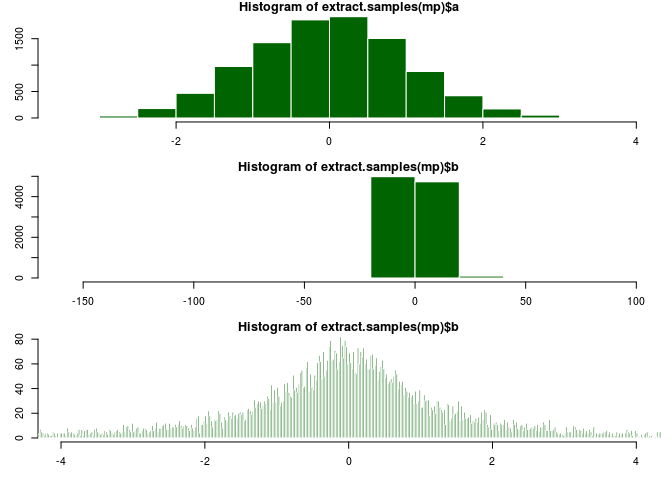
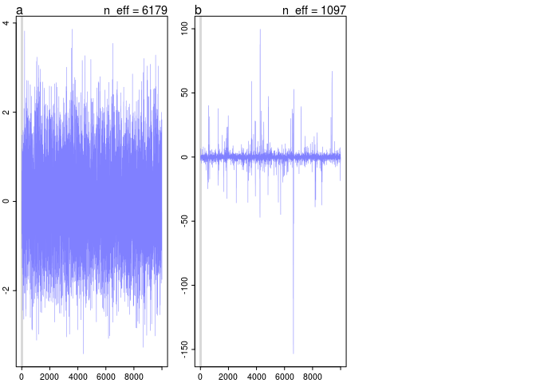

# chapter8homework_hardproblems
em  
July 13, 2016  


##8H1


```r
mp <- map2stan(
alist(
a ~ dnorm(0,1),
b ~ dcauchy(0,1)
),
data=list(y=1),
start=list(a=0,b=0),
iter=1e4, warmup=100 , WAIC=FALSE )
```

```
## 
## SAMPLING FOR MODEL 'a ~ dnorm(0, 1)' NOW (CHAIN 1).
## 
## Chain 1, Iteration:    1 / 10000 [  0%]  (Warmup)
## Chain 1, Iteration:  101 / 10000 [  1%]  (Sampling)
## Chain 1, Iteration: 1100 / 10000 [ 11%]  (Sampling)
## Chain 1, Iteration: 2100 / 10000 [ 21%]  (Sampling)
## Chain 1, Iteration: 3100 / 10000 [ 31%]  (Sampling)
## Chain 1, Iteration: 4100 / 10000 [ 41%]  (Sampling)
## Chain 1, Iteration: 5100 / 10000 [ 51%]  (Sampling)
## Chain 1, Iteration: 6100 / 10000 [ 61%]  (Sampling)
## Chain 1, Iteration: 7100 / 10000 [ 71%]  (Sampling)
## Chain 1, Iteration: 8100 / 10000 [ 81%]  (Sampling)
## Chain 1, Iteration: 9100 / 10000 [ 91%]  (Sampling)
## Chain 1, Iteration: 10000 / 10000 [100%]  (Sampling)# 
## #  Elapsed Time: 0.000711 seconds (Warm-up)
## #                0.06264 seconds (Sampling)
## #                0.063351 seconds (Total)
## # 
## 
## SAMPLING FOR MODEL 'a ~ dnorm(0, 1)' NOW (CHAIN 1).
## 
## Chain 1, Iteration: 1 / 1 [100%]  (Sampling)# 
## #  Elapsed Time: 2e-06 seconds (Warm-up)
## #                1.6e-05 seconds (Sampling)
## #                1.8e-05 seconds (Total)
## #
```

```r
par(mfrow=c(3,1), mar=c(3,3,1,1))
hist(extract.samples(mp)$a, col = "darkgreen", border="white")
hist(extract.samples(mp)$b, col = "darkgreen", border="white")
hist(extract.samples(mp)$b, xlim = c(-4,4), breaks=10000, col = "darkgreen", border="white")
```

<!-- -->

```r
plot(mp)
```

<!-- -->

A is sampled from the normal distribution and B is sampled from the couchy distribution. The normal distribution is pretty straightforward, with a mean of 0 and a standard deviation of 1 we can see that. However, the 0 and 1 in the cauchy correspond to the location and scale. The cauchy distribution has fat tails, which means that it's more likely that the chain will sample from somewhere really far away from the mean (-1000 in this case). When we zoom in on the distribution between -4 and 4, both look pretty similar.

