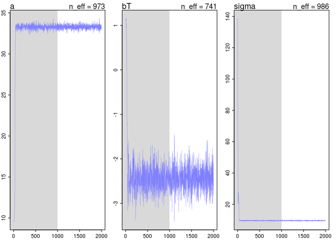
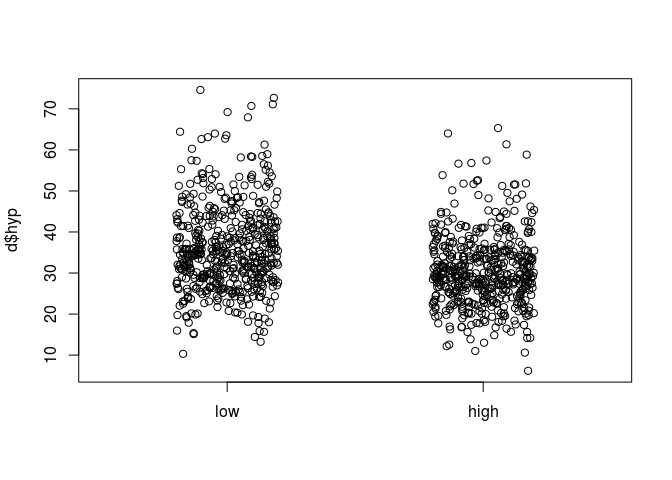
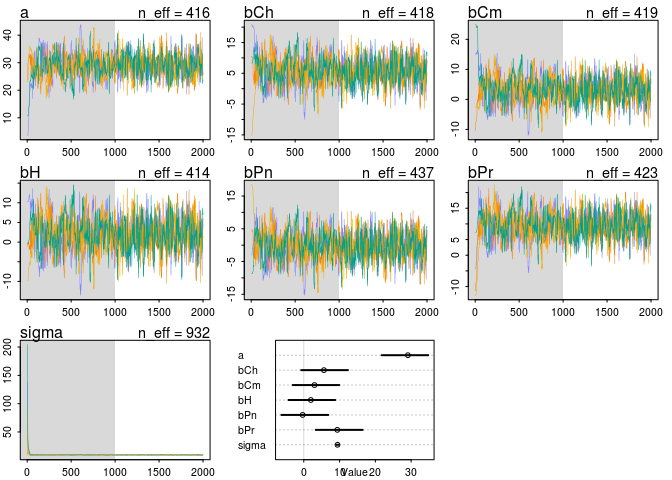
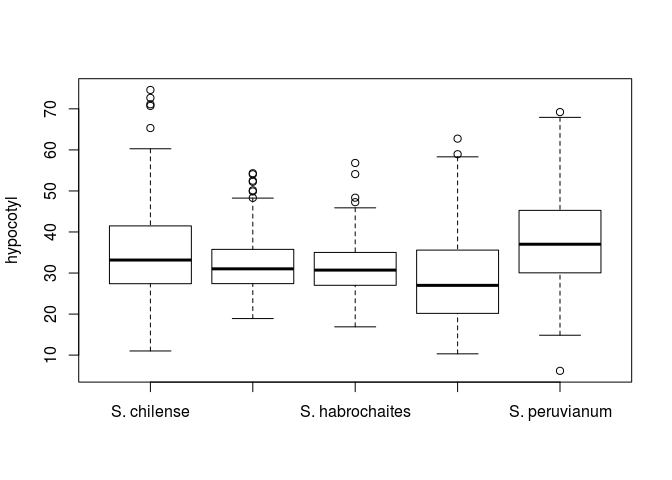

# 9.1
em  
July 30, 2016  

Do a Bayesian analysis of hypocotyl length (hyp) in the attached data sheet.

1) Consider treatment effects (trt) species effects (species) and their interaction.  What is the best model given these possible predictors?

First with treatment only

```r
setwd("~/Documents/Rclub-rethinking_Emily.Josephs/Assignment_Chapter_09")
d = read.csv('TomatoR2CSHL.csv', header=T)
d$trtNum = sapply(d$trt, function(x){if(x == 'H'){return(1)} else {return(-1)}})
d.trim = d[,c('trtNum','hyp')]
library(rethinking)
```

```
## Loading required package: rstan
```

```
## Loading required package: ggplot2
```

```
## rstan (Version 2.9.0-3, packaged: 2016-02-11 15:54:41 UTC, GitRev: 05c3d0058b6a)
```

```
## For execution on a local, multicore CPU with excess RAM we recommend calling
## rstan_options(auto_write = TRUE)
## options(mc.cores = parallel::detectCores())
```

```
## Loading required package: parallel
```

```
## rethinking (Version 1.58)
```

```r
#trt only
m1 <- map2stan(
  alist(
    hyp~dnorm(mu,sigma),
    mu <- a + bT*trtNum,
    a ~ dnorm(10,10),
    bT ~ dnorm(0,1),
    sigma ~ dcauchy(0,2)),
  data=d.trim
     )
```

```
## 
## SAMPLING FOR MODEL 'hyp ~ dnorm(mu, sigma)' NOW (CHAIN 1).
## 
## Chain 1, Iteration:    1 / 2000 [  0%]  (Warmup)
## Chain 1, Iteration:  200 / 2000 [ 10%]  (Warmup)
## Chain 1, Iteration:  400 / 2000 [ 20%]  (Warmup)
## Chain 1, Iteration:  600 / 2000 [ 30%]  (Warmup)
## Chain 1, Iteration:  800 / 2000 [ 40%]  (Warmup)
## Chain 1, Iteration: 1000 / 2000 [ 50%]  (Warmup)
## Chain 1, Iteration: 1001 / 2000 [ 50%]  (Sampling)
## Chain 1, Iteration: 1200 / 2000 [ 60%]  (Sampling)
## Chain 1, Iteration: 1400 / 2000 [ 70%]  (Sampling)
## Chain 1, Iteration: 1600 / 2000 [ 80%]  (Sampling)
## Chain 1, Iteration: 1800 / 2000 [ 90%]  (Sampling)
## Chain 1, Iteration: 2000 / 2000 [100%]  (Sampling)# 
## #  Elapsed Time: 0.173511 seconds (Warm-up)
## #                0.122531 seconds (Sampling)
## #                0.296042 seconds (Total)
## #
```

```
## The following numerical problems occured the indicated number of times after warmup on chain 1
```

```
##                                                                                 count
## Exception thrown at line 19: normal_log: Scale parameter is 0, but must be > 0!     2
```

```
## When a numerical problem occurs, the Metropolis proposal gets rejected.
```

```
## However, by design Metropolis proposals sometimes get rejected even when there are no numerical problems.
```

```
## Thus, if the number in the 'count' column is small, do not ask about this message on stan-users.
```

```
## 
## SAMPLING FOR MODEL 'hyp ~ dnorm(mu, sigma)' NOW (CHAIN 1).
## 
## Chain 1, Iteration: 1 / 1 [100%]  (Sampling)# 
## #  Elapsed Time: 2e-06 seconds (Warm-up)
## #                0.00011 seconds (Sampling)
## #                0.000112 seconds (Total)
## #
```

```
## Computing WAIC
```

```
## Constructing posterior predictions
```

```
## [ 100 / 1000 ]
[ 200 / 1000 ]
[ 300 / 1000 ]
[ 400 / 1000 ]
[ 500 / 1000 ]
[ 600 / 1000 ]
[ 700 / 1000 ]
[ 800 / 1000 ]
[ 900 / 1000 ]
[ 1000 / 1000 ]
```

```r
plot(m1)
```

<!-- -->

```r
precis(m1)
```

```
##        Mean StdDev lower 0.89 upper 0.89 n_eff Rhat
## a     33.30   0.28      32.89      33.75   973    1
## bT    -2.42   0.28      -2.85      -1.96   741    1
## sigma  9.59   0.21       9.27       9.94   986    1
```
So with treatment only, there's a negative relationship where the high treatment has shorter hypocotyls. Is this what the data looks like?

```r
plot(jitter(d$trtNum), d$hyp, xaxt = "n", xlim = c(-2,2), xlab = "")
axis(1, at = c(-1,1), labels = c("low","high"))
```

<!-- -->
Yep

Species only. I'm not sure how to deal with the categorical variables here, but I copied Julin's approach.


```r
library(reshape2)
data.species <- d[,c("hyp","species")]
data.species$id <- 1:nrow(data.species)
data.species <- dcast(data.species, hyp + id ~ species, value.var="species", fun.aggregate = length)
colnames(data.species) <- sub(". ","_",fixed = TRUE, colnames(data.species))

#species only

m2 <- map2stan(
  alist(
    hyp~dnorm(mu,sigma),
    mu <- a + bCh*S_chilense + bCm*S_chmielewskii + bH*S_habrochaites + bPn*S_pennellii + bPr*S_peruvianum,
    a ~ dnorm(10,10),
    c(bCh, bCm, bH, bPn, bPr) ~ dnorm(0,10),
    sigma ~ dcauchy(0,1)),
  data=data.species, chains=4
     )
```

```
## 
## SAMPLING FOR MODEL 'hyp ~ dnorm(mu, sigma)' NOW (CHAIN 1).
## 
## Chain 1, Iteration:    1 / 2000 [  0%]  (Warmup)
## Chain 1, Iteration:  200 / 2000 [ 10%]  (Warmup)
## Chain 1, Iteration:  400 / 2000 [ 20%]  (Warmup)
## Chain 1, Iteration:  600 / 2000 [ 30%]  (Warmup)
## Chain 1, Iteration:  800 / 2000 [ 40%]  (Warmup)
## Chain 1, Iteration: 1000 / 2000 [ 50%]  (Warmup)
## Chain 1, Iteration: 1001 / 2000 [ 50%]  (Sampling)
## Chain 1, Iteration: 1200 / 2000 [ 60%]  (Sampling)
## Chain 1, Iteration: 1400 / 2000 [ 70%]  (Sampling)
## Chain 1, Iteration: 1600 / 2000 [ 80%]  (Sampling)
## Chain 1, Iteration: 1800 / 2000 [ 90%]  (Sampling)
## Chain 1, Iteration: 2000 / 2000 [100%]  (Sampling)# 
## #  Elapsed Time: 5.17309 seconds (Warm-up)
## #                4.61141 seconds (Sampling)
## #                9.7845 seconds (Total)
## #
```

```
## The following numerical problems occured the indicated number of times after warmup on chain 1
```

```
##                                                                                 count
## Exception thrown at line 31: normal_log: Scale parameter is 0, but must be > 0!     2
```

```
## When a numerical problem occurs, the Metropolis proposal gets rejected.
```

```
## However, by design Metropolis proposals sometimes get rejected even when there are no numerical problems.
```

```
## Thus, if the number in the 'count' column is small, do not ask about this message on stan-users.
```

```
## 
## SAMPLING FOR MODEL 'hyp ~ dnorm(mu, sigma)' NOW (CHAIN 2).
## 
## Chain 2, Iteration:    1 / 2000 [  0%]  (Warmup)
## Chain 2, Iteration:  200 / 2000 [ 10%]  (Warmup)
## Chain 2, Iteration:  400 / 2000 [ 20%]  (Warmup)
## Chain 2, Iteration:  600 / 2000 [ 30%]  (Warmup)
## Chain 2, Iteration:  800 / 2000 [ 40%]  (Warmup)
## Chain 2, Iteration: 1000 / 2000 [ 50%]  (Warmup)
## Chain 2, Iteration: 1001 / 2000 [ 50%]  (Sampling)
## Chain 2, Iteration: 1200 / 2000 [ 60%]  (Sampling)
## Chain 2, Iteration: 1400 / 2000 [ 70%]  (Sampling)
## Chain 2, Iteration: 1600 / 2000 [ 80%]  (Sampling)
## Chain 2, Iteration: 1800 / 2000 [ 90%]  (Sampling)
## Chain 2, Iteration: 2000 / 2000 [100%]  (Sampling)# 
## #  Elapsed Time: 4.68174 seconds (Warm-up)
## #                3.28172 seconds (Sampling)
## #                7.96346 seconds (Total)
## # 
## 
## SAMPLING FOR MODEL 'hyp ~ dnorm(mu, sigma)' NOW (CHAIN 3).
## 
## Chain 3, Iteration:    1 / 2000 [  0%]  (Warmup)
## Chain 3, Iteration:  200 / 2000 [ 10%]  (Warmup)
## Chain 3, Iteration:  400 / 2000 [ 20%]  (Warmup)
## Chain 3, Iteration:  600 / 2000 [ 30%]  (Warmup)
## Chain 3, Iteration:  800 / 2000 [ 40%]  (Warmup)
## Chain 3, Iteration: 1000 / 2000 [ 50%]  (Warmup)
## Chain 3, Iteration: 1001 / 2000 [ 50%]  (Sampling)
## Chain 3, Iteration: 1200 / 2000 [ 60%]  (Sampling)
## Chain 3, Iteration: 1400 / 2000 [ 70%]  (Sampling)
## Chain 3, Iteration: 1600 / 2000 [ 80%]  (Sampling)
## Chain 3, Iteration: 1800 / 2000 [ 90%]  (Sampling)
## Chain 3, Iteration: 2000 / 2000 [100%]  (Sampling)# 
## #  Elapsed Time: 4.16855 seconds (Warm-up)
## #                2.67283 seconds (Sampling)
## #                6.84137 seconds (Total)
## # 
## 
## SAMPLING FOR MODEL 'hyp ~ dnorm(mu, sigma)' NOW (CHAIN 4).
## 
## Chain 4, Iteration:    1 / 2000 [  0%]  (Warmup)
## Chain 4, Iteration:  200 / 2000 [ 10%]  (Warmup)
## Chain 4, Iteration:  400 / 2000 [ 20%]  (Warmup)
## Chain 4, Iteration:  600 / 2000 [ 30%]  (Warmup)
## Chain 4, Iteration:  800 / 2000 [ 40%]  (Warmup)
## Chain 4, Iteration: 1000 / 2000 [ 50%]  (Warmup)
## Chain 4, Iteration: 1001 / 2000 [ 50%]  (Sampling)
## Chain 4, Iteration: 1200 / 2000 [ 60%]  (Sampling)
## Chain 4, Iteration: 1400 / 2000 [ 70%]  (Sampling)
## Chain 4, Iteration: 1600 / 2000 [ 80%]  (Sampling)
## Chain 4, Iteration: 1800 / 2000 [ 90%]  (Sampling)
## Chain 4, Iteration: 2000 / 2000 [100%]  (Sampling)# 
## #  Elapsed Time: 4.40558 seconds (Warm-up)
## #                4.24646 seconds (Sampling)
## #                8.65204 seconds (Total)
## #
```

```
## The following numerical problems occured the indicated number of times after warmup on chain 4
```

```
##                                                                                 count
## Exception thrown at line 31: normal_log: Scale parameter is 0, but must be > 0!     2
```

```
## When a numerical problem occurs, the Metropolis proposal gets rejected.
```

```
## However, by design Metropolis proposals sometimes get rejected even when there are no numerical problems.
```

```
## Thus, if the number in the 'count' column is small, do not ask about this message on stan-users.
```

```
## 
## SAMPLING FOR MODEL 'hyp ~ dnorm(mu, sigma)' NOW (CHAIN 1).
## 
## Chain 1, Iteration: 1 / 1 [100%]  (Sampling)# 
## #  Elapsed Time: 2e-06 seconds (Warm-up)
## #                0.000268 seconds (Sampling)
## #                0.00027 seconds (Total)
## #
```

```
## Computing WAIC
```

```
## Constructing posterior predictions
```

```
## [ 400 / 4000 ]
[ 800 / 4000 ]
[ 1200 / 4000 ]
[ 1600 / 4000 ]
[ 2000 / 4000 ]
[ 2400 / 4000 ]
[ 2800 / 4000 ]
[ 3200 / 4000 ]
[ 3600 / 4000 ]
[ 4000 / 4000 ]
```

```r
plot(m2)
precis(m2)
```

```
##        Mean StdDev lower 0.89 upper 0.89 n_eff Rhat
## a     29.09   4.02      21.77      34.77   416 1.01
## bCh    5.63   4.04      -0.72      12.33   418 1.01
## bCm    2.99   4.04      -3.08       9.91   419 1.00
## bH     1.98   4.05      -4.24       8.79   414 1.01
## bPn   -0.32   4.07      -6.25       6.85   437 1.00
## bPr    9.37   4.05       3.36      16.45   423 1.00
## sigma  9.42   0.21       9.09       9.76   932 1.00
```

```r
plot(precis(m2))
```

<!-- -->
I'm not totall sure how to interpret this -- essentially, all of the species beta estimates overlap 0 except for Peruvianum. Does that mean that only peruvianum shows a species specific effect?


```r
plot(d$species, d$hyp, ylab = "hypocotyl")
```

<!-- -->

```r
a1 <- aov(d$hyp ~ d$species)
summary(a1)
```

```
##               Df Sum Sq Mean Sq F value Pr(>F)    
## d$species      4  10483  2620.8    29.5 <2e-16 ***
## Residuals   1003  89095    88.8                   
## ---
## Signif. codes:  0 '***' 0.001 '**' 0.01 '*' 0.05 '.' 0.1 ' ' 1
```

```r
p1 <- TukeyHSD(x=a1, 'd$species', conf.level=0.95)
p1
```

```
##   Tukey multiple comparisons of means
##     95% family-wise confidence level
## 
## Fit: aov(formula = d$hyp ~ d$species)
## 
## $`d$species`
##                                      diff       lwr        upr     p adj
## S. chmielewskii-S. chilense     -2.677673 -5.155558 -0.1997875 0.0266409
## S. habrochaites-S. chilense     -3.681035 -6.158921 -1.2031503 0.0005073
## S. pennellii-S. chilense        -5.981674 -8.850501 -3.1128476 0.0000002
## S. peruvianum-S. chilense        3.752809  1.250479  6.2551381 0.0004317
## S. habrochaites-S. chmielewskii -1.003363 -3.426273  1.4195477 0.7897345
## S. pennellii-S. chmielewskii    -3.304002 -6.125481 -0.4825220 0.0123217
## S. peruvianum-S. chmielewskii    6.430481  3.982577  8.8783852 0.0000000
## S. pennellii-S. habrochaites    -2.300639 -5.122119  0.5208408 0.1700725
## S. peruvianum-S. habrochaites    7.433844  4.985940  9.8817481 0.0000000
## S. peruvianum-S. pennellii       9.734483  6.891512 12.5774543 0.0000000
```


2) Use "S. chmielewskii" as the reference.  For each of the other species evaluate the hypothesis that their response to shade differs from S. chmielewskii.


